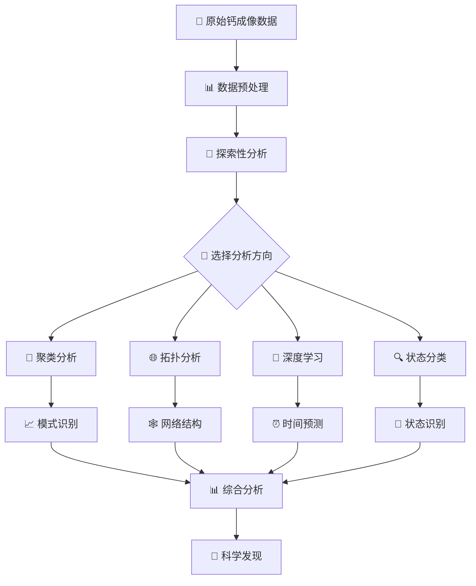

# 🧠 脑神经影像处理平台 | Brain Neuroimage Processing Platform

<div align="center">
    
    
    
    
    
    
</div>

<div align="center">
    <h3>🔬 世界领先的神经钙成像数据分析与机器学习平台</h3>
    <p><em>集成深度学习、图神经网络、拓扑分析、相空间重构的端到端神经科学研究工具</em></p>
</div>

---

[English](#english-documentation) | [中文](#中文文档)

## 🎯 项目概述

本项目是一个**世界领先的脑神经影像处理平台**，专门用于分析小鼠脑神经元的钙成像数据。平台集成了**9个核心模块**和**50+种前沿算法**，提供从原始数据预处理到高级机器学习分析的完整解决方案。

### 🆕 最新更新 (v2.0)

- ✅ **增强的图神经网络支持**: 新增GAT、时间GNN、集成GCN等多种先进架构
- ✅ **智能数据格式检测**: 支持Excel、MAT、CSV等多种数据格式的自动识别和处理
- ✅ **相空间重构技术**: 基于Takens嵌入定理的3D相空间轨迹生成和分析
- ✅ **Web界面集成**: 关键神经元分析的交互式Web应用
- ✅ **批处理与自动化**: 支持多数据集并行处理和自动化分析流程
- ✅ **增强的可视化**: 新增交互式网络图、动画生成、实时可视化等功能

### 🌟 核心创新点

- **🚀 多模态分析**: 集成传统统计分析、机器学习、深度学习和图神经网络
- **🔄 端到端流程**: 从原始钙成像数据到最终科学发现的完整自动化流程
- **🧠 神经科学专用**: 专门针对神经元活动模式、功能连接和行为关联设计
- **⚡ 高性能计算**: 支持GPU加速、并行处理和大规模数据分析
- **📊 丰富可视化**: 提供2D/3D交互式可视化、动画和Web界面
- **🎯 相空间分析**: 基于动力学系统理论的神经状态空间重构
- **🌐 图神经网络**: 多种GNN架构(GCN、GAT、时间GNN)用于复杂网络分析
- **🔬 效应量计算**: Cohen's d效应量分析识别关键神经元

### 🎓 科学意义

神经钙成像技术能够在**单细胞分辨率**水平上实时监测神经元活动，是现代神经科学研究的核心技术。本平台解决了以下关键科学问题：

- **🔍 模式发现**: 从复杂的神经活动中识别功能性神经元群体
- **🌐 网络分析**: 揭示神经元间的功能连接和网络拓扑结构
- **⏱️ 时间动力学**: 分析神经活动的时间模式和动态变化
- **🎯 行为关联**: 建立神经活动与动物行为之间的因果关系
- **🤖 智能分类**: 利用AI技术自动识别不同的神经状态
- **🔬 相空间重构**: 揭示神经系统的动力学特性和吸引子结构
- **📊 效应量分析**: 量化神经元对特定行为的判别能力和重要性

## 🏗️ 核心功能模块

### 1. 🔬 预分析模块 (Pre_analysis)
> **数据预处理与探索性分析的专业工具包**

<details>
<summary><b>📊 核心功能</b></summary>

- **🔄 数据整合与清洗**:
  - 智能合并多会话数据，自动处理缺失值和异常值
  - 支持Excel、CSV、MAT等多种数据格式
  - 数据质量控制和格式转换工具
- **📈 探索性数据分析 (EDA)**:
  - 神经活动时间序列可视化
  - 统计特征分析和分布检验
  - 相关性热图和网络分析
  - 数据初始化展示和概览分析
- **⚡ 特征提取**:
  - 钙波峰值检测和量化
  - 频域特征提取 (FFT, 小波变换)
  - 时域统计特征计算
  - 自动特征选择和重要性评估
- **🌊 信号处理**:
  - 多种平滑算法 (移动平均、高斯滤波、Butterworth滤波)
  - 去趋势和去噪处理
  - 信号标准化和归一化
  - 滤波器设计和噪声消除
- **🔄 周期性分析**:
  - 自相关函数计算
  - 功率谱密度分析
  - 节律模式识别
  - 周期性检测和时间模式分析
- **🎯 行为关联分析**:
  - 神经活动与行为事件的时间对齐
  - 事件相关电位 (ERP) 分析
  - 行为预测模型构建
  - 行为相关热图生成
- **🔍 单神经元分析**:
  - 个体神经元活动模式分析
  - 神经元响应特性评估
  - 单细胞水平的功能分析

</details>

### 2. 🎯 聚类分析模块 (Cluster_analysis)
> **多算法神经元功能分组与模式识别**

<details>
<summary><b>🤖 算法集成</b></summary>

- **🔍 经典聚类算法**:
  - K-means (多种距离度量: 欧氏距离、EMD、Hausdorff距离)
  - DBSCAN (密度聚类)
  - 高斯混合模型 (GMM)
  - 层次聚类 (Ward, Complete, Average linkage)
  - 谱聚类 (Spectral Clustering)
  - Mean Shift聚类
  - Affinity Propagation聚类
- **📉 降维技术**:
  - 主成分分析 (PCA)
  - t-分布随机邻域嵌入 (t-SNE)
  - 统一流形逼近与投影 (UMAP)
  - 多维标度 (MDS)
  - 独立成分分析 (ICA)
- **📏 距离度量**:
  - 欧氏距离、曼哈顿距离、余弦距离
  - 地球移动距离 (EMD)
  - Hausdorff距离
  - 动态时间规整 (DTW)
  - 相关性距离
- **📊 质量评估**:
  - 轮廓系数 (Silhouette Score)
  - Calinski-Harabasz指数
  - Davies-Bouldin指数
  - 调整兰德指数 (ARI)
  - 归一化互信息 (NMI)
  - 肘部法则和Gap统计
- **🎬 动态可视化**:
  - 实时神经元活动条形图
  - 聚类结果3D散点图
  - 时间演化动画
  - 交互式聚类结果展示
- **🔧 自动化功能**:
  - 最优聚类数自动选择
  - 算法性能对比分析
  - 聚类稳定性评估

</details>

### 3. 🌐 拓扑分析模块 (Topology_analysis)
> **神经网络拓扑结构与连接模式分析**

<details>
<summary><b>🕸️ 网络分析</b></summary>

- **🏗️ 拓扑构建**:
  - 基于活动状态的时间序列拓扑生成
  - 功能连接矩阵构建
  - 动态网络重构
- **🔄 矩阵转换**:
  - 邻接矩阵标准化
  - 拉普拉斯矩阵计算
  - 图谱分析
- **🎯 模式识别**:
  - 社区检测算法 (Louvain, Leiden)
  - 模块化分析
  - 核心-边缘结构识别
- **⏰ 时空分析**:
  - 时间窗口滑动分析
  - 空间位置相关性
  - 动态连接强度变化
- **🎨 可视化**:
  - 交互式网络图 (2D/3D)
  - 连接强度热图
  - 动态网络演化视频

</details>

### 4. 🧠 LSTM深度学习模块 (LSTM)
> **基于深度学习的时间序列分析与预测**

<details>
<summary><b>🤖 深度学习架构</b></summary>

- **🔗 LSTM网络**:
  - 双向LSTM编码器
  - 多层LSTM堆叠
  - 增强型LSTM (带自编码器和注意力机制)
  - 梯度裁剪和学习率调度
- **🎯 时间模式分析**:
  - 序列编码与解码
  - 时间特征提取
  - 模式聚类分析
  - 时间序列预测和分类
- **🌐 图神经网络集成**:
  - GCN (图卷积网络) 用于行为预测
  - GAT (图注意力网络) 用于功能模块识别
  - 时间GNN (结合LSTM和GNN的时间图网络)
  - 基于GNN嵌入的拓扑结构重构
- **🔄 网络拓扑分析**:
  - 基于LSTM嵌入的功能连接
  - 动态网络重构
  - 连接强度预测
  - GNN增强的模块识别
- **📊 可视化系统**:
  - 交互式网络可视化
  - 时间序列预测图表
  - 注意力权重热图
  - GNN嵌入可视化
  - GAT注意力权重可视化
- **🎯 行为预测与分析**:
  - 神经状态分类
  - 行为事件预测
  - 因果关系分析
  - 神经元功能连接分析
- **🔧 模型优化**:
  - 自动超参数调优
  - 模型集成和交叉验证
  - GPU加速训练
  - 批处理优化

</details>

### 5. 🎯 状态分类器模块 (StateClassifier)
> **基于图神经网络的神经状态智能分类**

<details>
<summary><b>🧠 GCN架构</b></summary>

- **📊 相空间重构**:
  - Takens嵌入定理应用
  - 时间延迟互信息计算
  - 3D相空间轨迹生成
  - 嵌入参数自动估计
- **🌐 图神经网络**:
  - 多层图卷积网络 (GCN)
  - 正则化轻量级GCN
  - 集成GCN模型
  - 全局池化策略
  - 端到端分类器
- **📁 数据支持**:
  - Excel/MAT文件智能读取
  - 自动数据格式检测
  - 异常值处理和标准化
  - Z-score标准化
  - 缺失值智能处理
- **🎯 分类任务**:
  - 神经状态自动识别
  - 多类别分类支持
  - 模型性能评估
  - 混淆矩阵分析
  - ROC曲线和AUC评估
- **🔧 模型优化**:
  - 标签平滑技术
  - DropPath正则化
  - 多尺度特征融合
  - 自适应学习率调度
- **📊 可视化分析**:
  - 3D相空间轨迹可视化
  - 图结构可视化
  - 分类边界展示
  - 特征重要性分析

</details>

### 6. 🔍 关键神经元分析模块 (Principal_neuron)
> **效应量计算与关键神经元识别 (v2.0)**

<details>
<summary><b>📊 效应量分析</b></summary>

- **📈 Cohen's d计算**:
  - 神经元判别能力量化
  - 效应量阈值优化
  - 关键神经元自动识别
  - 从原始数据到效应量的完整流程
- **🗺️ 空间可视化**:
  - 神经元真实位置映射
  - 多行为状态对比
  - 颜色编码系统
  - 背景神经元显示
- **🔗 关系分析**:
  - 行为特异性神经元
  - 共享神经元识别
  - 神经元社区检测
  - 特有神经元分析
- **⏰ 时间模式分析**:
  - 时间序列模式识别
  - 神经元聚类分析
  - 响应模式识别
  - 时间动力学分析
- **🌐 Web界面**:
  - 交互式数据探索
  - 实时分析结果展示
  - 用户友好的操作界面
  - Flask Web应用
- **📊 研究方法建议**:
  - 自动化研究工作流程推荐
  - 分析方法建议系统
  - 统计分析指导
  - 实验设计建议

</details>

### 7. 🌐 图神经网络模块 (rawgcn & bettergcn)
> **先进的图卷积网络实现与对比**

<details>
<summary><b>🚀 GCN变体</b></summary>

- **🔧 多种GCN架构**:
  - rawgcn: 原始GCN基础实现
  - bettergcn: 改进的GCN变体
  - 时间图神经网络
  - 多层GCN堆叠
- **⚡ 性能优化**:
  - GPU加速训练
  - 批处理优化
  - 内存效率提升
  - 梯度累积技术
- **📊 特征工程**:
  - 自动特征提取
  - 图结构优化
  - 节点嵌入学习
  - 边特征处理
- **🔄 模型对比**:
  - 原始vs改进GCN性能对比
  - 不同架构效果评估
  - 超参数敏感性分析
  - 收敛速度对比
- **📈 训练框架**:
  - 端到端训练流程
  - 模型验证和测试
  - 性能指标监控
  - 结果可视化

</details>

### 8. 📊 可视化模块 (Visualization)
> **专业的神经数据可视化工具集**

<details>
<summary><b>🎨 可视化功能</b></summary>

- **📈 时间序列可视化**:
  - 多神经元活动轨迹
  - 交互式时间轴
  - 实时数据流显示
  - 神经元活动时间线可视化
- **🌐 网络可视化**:
  - 3D神经网络图
  - 动态连接展示
  - 社区结构高亮
  - 交互式网络图
- **🎬 动画生成**:
  - 神经活动演化动画
  - 网络变化时间序列
  - 行为事件标记
  - GIF动画导出
- **📊 聚类可视化**:
  - 聚类结果展示
  - 降维投影可视化
  - 聚类质量评估图表
  - 子峰分析可视化
- **🔥 热图分析**:
  - 神经活动热图
  - 相关性矩阵热图
  - 行为相关热图
  - 动态热图展示
- **🎯 交互式功能**:
  - 实时参数调整
  - 缩放和平移
  - 数据点选择
  - 多视图联动

</details>

### 9. 🔬 SCN研究项目 (SCN-Research-Project)
> **超交叉核专项研究工具**

<details>
<summary><b>🧬 专业分析</b></summary>

- **⏰ 时间预测器**:
  - 神经活动时间模式预测
  - 节律分析
  - 周期性检测
  - CNN时间序列预测模型
- **🎯 归因分析**:
  - 神经元贡献度分析
  - 特征重要性评估
  - 因果关系推断
  - 神经元影响力量化
- **🔄 轨迹对比**:
  - 多条件对比分析
  - 差异显著性检验
  - 模式变化追踪
  - 时空轨迹分析
- **🧠 状态分类器**:
  - SCN特异性状态识别
  - 相空间重构分析
  - 动力学特性评估
- **📊 子模块分析**:
  - 不同脑区子模块分析
  - 跨区域连接分析
  - 模块间信息传递
- **🔧 专用工具**:
  - SCN数据预处理
  - 专业可视化工具
  - 自动化分析流程

</details>

## 📁 项目架构

<details>
<summary><b>🗂️ 完整目录结构</b></summary>

```
Brain_Neuroimage_Processing/
├── 📊 Pre_analysis/                    # 数据预处理与探索性分析
│   ├── src/                           # 核心处理算法
│   │   ├── EDA/                       # 探索性数据分析
│   │   │   ├── init_show.py          # 数据初始化展示
│   │   │   ├── Correlation_Analysis.py # 相关性分析
│   │   │   └── statistical_analysis.py # 统计分析工具
│   │   ├── DataIntegration/           # 数据整合与清洗
│   │   │   ├── data_merger.py        # 多会话数据合并
│   │   │   ├── quality_control.py    # 数据质量控制
│   │   │   └── format_converter.py   # 格式转换工具
│   │   ├── Feature/                   # 特征提取工具
│   │   │   ├── calcium_wave_detector.py # 钙波检测
│   │   │   ├── frequency_analysis.py    # 频域分析
│   │   │   └── statistical_features.py # 统计特征
│   │   ├── smooth/                    # 信号处理与平滑
│   │   │   ├── smooth_data.py        # 数据平滑算法
│   │   │   ├── filter_design.py     # 滤波器设计
│   │   │   └── noise_reduction.py   # 噪声消除
│   │   ├── Periodic/                  # 周期性与节律分析
│   │   ├── oneNeuronal/              # 单神经元分析
│   │   ├── heatmap/                  # 热图可视化
│   │   │   └── heatmap_behavior.py  # 行为相关热图
│   │   └── Comparative/              # 比较分析工具
│   ├── datasets/                     # 数据存储
│   ├── processed_data/               # 处理后数据
│   ├── raw_data/                     # 原始数据
│   └── graph/                        # 可视化结果
│
├── 🎯 Cluster_analysis/                # 聚类分析与模式识别
│   ├── src/                          # 聚类算法实现
│   │   ├── k-means-ed.py            # 欧氏距离K-means
│   │   ├── k-means-emd.py           # EMD距离K-means
│   │   ├── k-means-hausdorff.py     # Hausdorff距离K-means
│   │   ├── DBSCAN.py                # 密度聚类
│   │   ├── GMM.py                   # 高斯混合模型
│   │   ├── Hierarchical.py          # 层次聚类
│   │   ├── Spectral.py              # 谱聚类
│   │   ├── pca_analysis.py          # 主成分分析
│   │   ├── tsne_analysis.py         # t-SNE降维
│   │   ├── umap_analysis.py         # UMAP降维
│   │   ├── Active_bar_chart.py      # 动态活动可视化
│   │   └── cluster_evaluation.py    # 聚类质量评估
│   └── datasets/                     # 聚类数据集
│
├── 🌐 Topology_analysis/              # 网络拓扑与连接分析
│   ├── src/                          # 拓扑分析核心
│   │   ├── TopologyToMatrix.py      # 拓扑矩阵生成
│   │   ├── TopologyToMatrix_light.py # 轻量级拓扑分析
│   │   ├── Cluster_topology.py      # 拓扑聚类分析
│   │   ├── Cluster_topology_integrated.py # 集成拓扑聚类
│   │   ├── Pos_topology.py          # 空间拓扑分析
│   │   ├── Time_topology.py         # 时间拓扑分析
│   │   ├── Dynamic_Sorting.py       # 动态结构排序
│   │   └── network_metrics.py       # 网络指标计算
│   ├── datasets/                     # 拓扑数据
│   ├── result/                       # 分析结果
│   ├── graph/                        # 网络可视化
│   └── requirements.txt              # 模块依赖
│
├── 🧠 LSTM/                           # 深度学习时间序列分析
│   ├── src/                          # LSTM核心算法
│   │   ├── lib/                      # 支持库
│   │   ├── neuron_lstm.py           # 神经元LSTM模型
│   │   ├── neuron_gnn.py            # 图神经网络模型
│   │   ├── kmeans_lstm_analysis.py  # LSTM+聚类分析
│   │   ├── analysis_results.py      # 结果分析工具
│   │   ├── pos_topology_js.py       # 交互式网络可视化
│   │   └── visualization.py         # 可视化工具集
│   ├── datasets/                     # LSTM训练数据
│   ├── models/                       # 预训练模型
│   ├── results/                      # 分析结果
│   ├── doc/                          # 文档说明
│   └── requirements.txt              # 模块依赖
│
├── 🎯 StateClassifier/                # 图神经网络状态分类器
│   ├── src/                          # 核心处理模块
│   │   ├── mutual.py                # 互信息计算
│   │   ├── phasespace.py            # 相空间重构
│   │   ├── cellset2trim.py          # 数据标准化
│   │   └── format_convert.py        # 格式转换
│   ├── excel_data_processor.py       # Excel数据处理器
│   ├── scn_phase_space_process.py    # 相空间处理主程序
│   ├── model.py                      # GCN模型定义
│   ├── main.py                       # 训练主程序
│   ├── config.py                     # 配置管理
│   ├── run.py                        # 便捷运行脚本
│   ├── datasets/                     # 图数据集
│   ├── results/                      # 训练结果
│   └── logs/                         # 日志文件
│
├── 🔍 principal_neuron/               # 关键神经元分析
│   ├── src/                          # 分析工具
│   │   ├── effect_size_calculator.py # 效应量计算器
│   │   ├── main_emtrace01_analysis.py # 主分析脚本
│   │   ├── data_loader.py           # 数据加载器
│   │   ├── plotting_utils.py        # 绘图工具
│   │   ├── key_neurons_community_analysis.py # 神经元社区分析
│   │   ├── temporal_pattern_analysis.py # 时间模式分析
│   │   └── research_methodology_advisor.py # 研究方法顾问
│   ├── data/                         # 实验数据
│   ├── output_plots/                 # 输出图表
│   ├── effect_size_output/           # 效应量结果
│   ├── app.py                        # Web应用
│   ├── templates/                    # Web模板
│   └── static/                       # 静态资源
│
├── 🌐 rawgcn/                         # 原始图卷积网络
│   ├── model.py                      # GCN模型实现
│   ├── train.py                      # 训练脚本
│   ├── process.py                    # 数据处理
│   ├── main.py                       # 主程序
│   ├── dataset/                      # 数据集
│   └── results/                      # 训练结果
│
├── 🚀 bettergcn/                      # 改进的图卷积网络
│   ├── src/                          # 改进算法
│   ├── datasets/                     # 数据集
│   └── results/                      # 结果输出
│
├── 📊 Visualization/                  # 专业可视化工具
│   ├── src/                          # 可视化算法
│   ├── datasets/                     # 可视化数据
│   ├── results/                      # 可视化结果
│   └── logs/                         # 日志记录
│
├── 🔬 SCN-Research-Project-main/      # SCN专项研究
│   ├── StateClassifier/              # 状态分类器
│   ├── TimePredictor/                # 时间预测器
│   ├── SubModule_TimePredictor/      # 时间预测子模块
│   ├── Attribution_analysis/         # 归因分析
│   ├── TraceContrast/               # 轨迹对比
│   └── torch.yaml                    # PyTorch配置
│
├── 📋 requirements.txt                # 全局依赖管理
├── 🔧 config.yaml                     # 全局配置文件
└── 📖 README.md                       # 项目说明文档
```

</details>

## ⚙️ 技术栈与依赖

### 🔧 核心技术栈

<div align="center">

| 🧠 **深度学习** | 🌐 **图神经网络** | 📊 **数据科学** | 🎨 **可视化** |
|:---:|:---:|:---:|:---:|
| PyTorch 2.1+ | PyTorch Geometric | NumPy, Pandas | Matplotlib, Plotly |
| LSTM, GRU | GCN, GAT | Scikit-learn | Seaborn, Bokeh |
| Transformer | Temporal GNN | SciPy, Statsmodels | D3.js, Plotly.js |
| Autoencoder | 集成GCN | UMAP, t-SNE | Interactive Widgets |
| 注意力机制 | 图注意力网络 | NetworkX | Flask Web应用 |

</div>

### 🆕 新增技术特性

- **🔬 相空间重构**: 基于Takens嵌入定理的动力学系统分析
- **🧠 图神经网络**: 多种GNN架构(GCN、GAT、时间GNN)
- **📊 效应量分析**: Cohen's d效应量计算和关键神经元识别
- **🌐 Web界面**: Flask驱动的交互式分析界面
- **⚡ 智能数据处理**: 自动格式检测和多格式支持
- **🎯 批处理系统**: 并行处理和自动化分析流程

### 📦 依赖管理

<details>
<summary><b>🔍 查看完整依赖列表</b></summary>

**核心科学计算库:**
```bash
numpy>=1.21.0              # 数值计算基础
pandas>=1.3.0               # 数据处理与分析
scipy>=1.7.0                # 科学计算工具
scikit-learn>=1.0.0         # 机器学习算法
statsmodels>=0.13.0         # 统计分析
```

**深度学习框架:**
```bash
torch>=2.1.0                # PyTorch深度学习框架
torchvision>=0.16.0         # 计算机视觉工具
torchaudio>=2.1.0           # 音频处理工具
torch-geometric>=2.0.0      # 图神经网络库
torch-scatter>=2.0.9        # 图操作加速
torch-sparse>=0.6.13        # 稀疏张量操作
torch-cluster>=1.6.0        # 图聚类算法
torch-spline-conv>=1.2.1    # 样条卷积
```

**可视化与交互:**
```bash
matplotlib>=3.4.0           # 基础绘图库
seaborn>=0.11.0             # 统计可视化
plotly>=5.3.0               # 交互式可视化
plotly-express>=0.4.0       # 快速可视化
jupyter>=1.0.0              # Jupyter笔记本
ipywidgets>=7.6.0           # 交互式组件
flask>=2.0.0                # Web应用框架
```

**专业分析工具:**
```bash
networkx>=2.6.0             # 网络分析
umap-learn>=0.5.3           # 降维算法
hdbscan>=0.8.29             # 密度聚类
h5py>=3.6.0                 # HDF5数据格式
openpyxl>=3.0.9             # Excel文件支持
sklearn-extra>=0.2.0        # 额外聚类算法
selenium>=4.0.0             # Web自动化
webdriver-manager>=3.5.0    # 浏览器驱动管理
```

**开发与测试:**
```bash
pytest>=6.2.5              # 单元测试框架
pytest-cov>=2.12.0         # 测试覆盖率
tqdm>=4.62.0                # 进度条显示
typing-extensions>=3.10.0   # 类型提示扩展
```

</details>

### 🚀 快速安装

<details>
<summary><b>📥 一键安装指南</b></summary>

#### 方法1: 完整安装 (推荐)
```bash
# 1. 克隆仓库
git clone https://github.com/yourusername/Brain_Neuroimage_Processing.git
cd Brain_Neuroimage_Processing

# 2. 创建虚拟环境 (强烈推荐)
python -m venv brain_analysis_env
# Windows:
brain_analysis_env\Scripts\activate
# Linux/Mac:
source brain_analysis_env/bin/activate

# 3. 升级pip
python -m pip install --upgrade pip

# 4. 安装核心依赖
pip install -r requirements.txt

# 5. 验证安装
python -c "import torch; import torch_geometric; print('✅ 深度学习框架安装成功!')"
python -c "import pandas; import numpy; import sklearn; print('✅ 数据科学库安装成功!')"
python -c "import plotly; import matplotlib; print('✅ 可视化库安装成功!')"
```

#### 方法2: 模块化安装
```bash
# 基础模块 (必需)
pip install numpy pandas scipy matplotlib seaborn

# 机器学习模块
pip install scikit-learn umap-learn hdbscan sklearn-extra

# 深度学习模块 (可选)
pip install torch torchvision torchaudio
pip install torch-geometric torch-scatter torch-sparse

# 可视化模块 (可选)
pip install plotly jupyter ipywidgets flask

# Web自动化模块 (可选)
pip install selenium webdriver-manager

# 特定模块依赖
pip install -r LSTM/requirements.txt          # LSTM模块
pip install -r Topology_analysis/requirements.txt  # 拓扑分析
pip install -r StateClassifier/requirements.txt    # 状态分类器
```

#### 方法3: Conda安装 (推荐GPU用户)
```bash
# 创建conda环境
conda create -n brain_analysis python=3.9
conda activate brain_analysis

# 安装PyTorch (GPU版本)
conda install pytorch torchvision torchaudio pytorch-cuda=11.8 -c pytorch -c nvidia

# 安装其他依赖
pip install torch-geometric
pip install -r requirements.txt
```

</details>

### 🔧 环境配置

<details>
<summary><b>⚙️ 系统要求与配置</b></summary>

**最低系统要求:**
- **操作系统**: Windows 10+, macOS 10.15+, Ubuntu 18.04+
- **Python版本**: 3.8 - 3.11
- **内存**: 8GB RAM (推荐16GB+)
- **存储**: 5GB可用空间
- **处理器**: 多核CPU (推荐8核+)

**推荐配置:**
- **GPU**: NVIDIA GPU with CUDA 11.8+ (用于深度学习加速)
- **内存**: 32GB+ RAM (用于大规模数据分析)
- **存储**: SSD硬盘 (提升I/O性能)
- **网络**: 稳定的网络连接 (用于下载预训练模型)

**GPU配置 (可选但推荐):**
```bash
# 检查CUDA可用性
python -c "import torch; print(f'CUDA可用: {torch.cuda.is_available()}')"
python -c "import torch; print(f'GPU数量: {torch.cuda.device_count()}')"

# 设置GPU内存增长 (避免OOM错误)
export PYTORCH_CUDA_ALLOC_CONF=max_split_size_mb:512
```

</details>

### ✅ 安装验证

<details>
<summary><b>🧪 验证安装是否成功</b></summary>

```bash
# 运行完整的环境检查
python -c "
import sys
print(f'Python版本: {sys.version}')

# 检查核心库
try:
    import numpy as np
    import pandas as pd
    import matplotlib.pyplot as plt
    import seaborn as sns
    import sklearn
    print('✅ 基础科学计算库: 正常')
except ImportError as e:
    print(f'❌ 基础库导入失败: {e}')

# 检查深度学习库
try:
    import torch
    import torch_geometric
    print(f'✅ PyTorch版本: {torch.__version__}')
    print(f'✅ PyG版本: {torch_geometric.__version__}')
    print(f'✅ CUDA可用: {torch.cuda.is_available()}')
except ImportError as e:
    print(f'⚠️ 深度学习库: {e}')

# 检查可视化库
try:
    import plotly
    import networkx as nx
    print('✅ 可视化库: 正常')
except ImportError as e:
    print(f'⚠️ 可视化库: {e}')

print('\\n🎉 环境检查完成!')
"

# 运行快速功能测试
python -c "
# 测试数据处理
import numpy as np
data = np.random.randn(100, 10)
print(f'✅ 数据生成测试: {data.shape}')

# 测试机器学习
from sklearn.cluster import KMeans
kmeans = KMeans(n_clusters=3, random_state=42)
labels = kmeans.fit_predict(data)
print(f'✅ 聚类测试: {len(set(labels))} 个聚类')

print('🚀 功能测试通过!')
"
```

</details>

### 🎯 快速开始

<details>
<summary><b>🚀 5分钟快速体验</b></summary>

```bash
# 1. 进入项目目录
cd Brain_Neuroimage_Processing

# 2. 运行预分析模块示例
cd Pre_analysis/src/EDA
python init_show.py --demo

# 3. 测试聚类分析
cd ../../../Cluster_analysis/src
python k-means-ed.py --demo

# 4. 体验状态分类器
cd ../../StateClassifier
python run.py --check    # 检查环境
python run.py --test     # 运行测试
python run.py --demo     # 演示模式

# 5. 启动关键神经元分析Web界面
cd ../principal_neuron
python app.py
# 浏览器访问: http://localhost:5000

# 6. 测试LSTM深度学习模块
cd ../LSTM/src
python test_env.py       # 环境测试
python neuron_lstm.py --demo  # LSTM演示

# 7. 查看可视化示例
cd ../../Visualization/src
python cluster.py --demo --interactive
```

</details>

## 🔄 完整工作流程

### 📋 标准分析流程

<div align="center">



</div>

### 🚀 快速开始指南

<details>
<summary><b>🎯 新手推荐流程 (30分钟)</b></summary>

```bash
# 🔥 一键体验完整流程
./scripts/quick_demo.sh

# 或者手动执行以下步骤:

# 1️⃣ 数据预处理与可视化 (5分钟)
cd Pre_analysis/src/EDA
python init_show.py --demo
python Correlation_Analysis.py --quick

# 2️⃣ 聚类分析体验 (10分钟)
cd ../../../Cluster_analysis/src
python k-means-ed.py --demo
python umap_analysis.py --plot

# 3️⃣ 神经网络状态分类 (10分钟)
cd ../../StateClassifier
python run.py --demo

# 4️⃣ 关键神经元分析 (5分钟)
cd ../principal_neuron
python example_usage.py
```

</details>

### 🔬 详细分析流程

#### 1️⃣ 数据预处理模块 (Pre_analysis)

<details>
<summary><b>📊 数据预处理详细步骤</b></summary>

```bash
# 🔍 步骤1: 数据质量检查
cd Pre_analysis/src/DataIntegration
python quality_control.py --input datasets/ --output processed_data/

# 📈 步骤2: 探索性数据分析
cd ../EDA
python init_show.py                    # 数据概览
python Correlation_Analysis.py        # 相关性分析
python statistical_analysis.py        # 统计特征分析

# ⚡ 步骤3: 信号处理与特征提取
cd ../smooth
python smooth_data.py --method butterworth  # 信号平滑
cd ../Feature
python calcium_wave_detector.py             # 钙波检测
python frequency_analysis.py                # 频域分析

# 🔄 步骤4: 周期性分析
cd ../Periodic
python periodicity_analysis.py              # 节律检测
python autocorrelation_analysis.py          # 自相关分析

# 🎨 步骤5: 可视化生成
cd ../heatmap
python heatmap_behavior.py                  # 行为相关热图
cd ../Comparative
python comparative_analysis.py              # 比较分析
```

**输出结果:**
- `processed_data/`: 清洗后的数据
- `graph/`: 可视化图表
- `analysis_report.html`: 分析报告

</details>

#### 2️⃣ 聚类分析模块 (Cluster_analysis)

<details>
<summary><b>🎯 多算法聚类分析</b></summary>

```bash
cd Cluster_analysis/src

# 🔍 经典聚类算法对比
python k-means-ed.py          # 欧氏距离K-means
python k-means-emd.py         # EMD距离K-means
python k-means-hausdorff.py   # Hausdorff距离K-means
python DBSCAN.py              # 密度聚类
python GMM.py                 # 高斯混合模型
python Hierarchical.py        # 层次聚类
python Spectral.py            # 谱聚类

# 📉 降维可视化
python pca_analysis.py        # 主成分分析
python tsne_analysis.py       # t-SNE降维
python umap_analysis.py       # UMAP降维

# 📊 聚类质量评估
python cluster_evaluation.py  # 多指标评估

# 🎬 动态可视化
python Active_bar_chart.py    # 实时活动条形图
```

**输出结果:**
- `results/clustering_comparison.html`: 算法对比报告
- `results/cluster_labels.csv`: 聚类标签
- `results/evaluation_metrics.json`: 评估指标

</details>

#### 3️⃣ 拓扑分析模块 (Topology_analysis)

<details>
<summary><b>🌐 网络拓扑结构分析</b></summary>

```bash
cd Topology_analysis/src

# 🏗️ 拓扑结构构建
python TopologyToMatrix.py              # 基础拓扑矩阵
python TopologyToMatrix_light.py        # 轻量级版本

# 🎯 拓扑聚类分析
python Cluster_topology.py              # 标准拓扑聚类
python Cluster_topology_integrated.py   # 集成多算法
python Cluster_topology_NoExp_light.py  # 无实验轻量版

# 🗺️ 空间与时间分析
python Pos_topology.py                  # 空间拓扑分析
python Time_topology.py                 # 时间拓扑分析
python Dynamic_Sorting.py               # 动态结构排序

# 📊 网络指标计算
python network_metrics.py               # 网络特征指标
```

**输出结果:**
- `result/topology_matrices.npz`: 拓扑矩阵
- `graph/network_visualization.html`: 交互式网络图
- `result/network_metrics.csv`: 网络指标

</details>

#### 4️⃣ LSTM深度学习模块 (LSTM)

<details>
<summary><b>🧠 深度学习时间序列分析</b></summary>

```bash
cd LSTM/src

# 🤖 LSTM模型训练
python neuron_lstm.py                   # 基础LSTM模型
python neuron_gnn.py                    # 图神经网络模型

# 🎯 结合聚类的LSTM分析
python kmeans_lstm_analysis.py          # LSTM+K-means

# 📊 结果分析与可视化
python analysis_results.py              # 结果分析
python visualization.py                 # 可视化工具

# 🌐 交互式网络可视化
python pos_topology_js.py               # JavaScript网络图
```

**输出结果:**
- `models/`: 训练好的模型文件
- `results/predictions.csv`: 预测结果
- `results/interactive_network.html`: 交互式网络

</details>

#### 5️⃣ 状态分类器模块 (StateClassifier)

<details>
<summary><b>🎯 图神经网络状态分类</b></summary>

```bash
cd StateClassifier

# 🔧 环境检查与配置
python run.py --check                   # 检查运行环境
python run.py --config                  # 查看配置参数

# 📊 数据处理
python run.py --process                 # 数据预处理
python test_excel_processor.py          # 测试Excel处理

# 🤖 模型训练
python run.py --train                   # 训练GCN模型
python run.py --test                    # 测试模型性能

# 🚀 一键运行
python run.py --all                     # 完整流程
```

**输出结果:**
- `datasets/`: 图数据集文件
- `results/best_model.pth`: 最佳模型
- `logs/`: 详细日志

</details>

#### 6️⃣ 关键神经元分析 (Principal_neuron)

<details>
<summary><b>🔍 效应量分析与关键神经元识别</b></summary>

```bash
cd principal_neuron

# 📊 效应量计算
python src/effect_size_calculator.py    # Cohen's d计算
python src/main_emtrace01_analysis.py   # 主分析流程

# 🗺️ 空间位置分析
python src/plotting_utils.py            # 空间可视化
python src/key_neurons_community_analysis.py  # 社区分析

# ⏰ 时间模式分析
python src/temporal_pattern_analysis.py # 时间模式
python src/neuron_animation_generator.py # 动画生成

# 🌐 Web界面启动
python app.py                           # 启动Web应用
# 访问: http://localhost:5000

# 📖 研究方法建议
python src/research_methodology_advisor.py  # 方法学建议
```

**输出结果:**
- `output_plots/`: 分析图表
- `effect_size_output/`: 效应量结果
- Web界面: 交互式分析

</details>

### 🎯 高级分析流程

<details>
<summary><b>🚀 专家级分析流程</b></summary>

```bash
# 🔬 SCN专项研究
cd SCN-Research-Project-main
python StateClassifier/main.py          # 状态分类
python TimePredictor/predict.py         # 时间预测
python Attribution_analysis/analyze.py  # 归因分析

# 🌐 图神经网络对比
cd rawgcn
python main.py                          # 原始GCN
cd ../bettergcn
python main.py                          # 改进GCN

# 📊 专业可视化
cd Visualization/src
python advanced_visualization.py        # 高级可视化
python interactive_dashboard.py         # 交互式仪表板
```

</details>

### 📊 批处理与自动化

<details>
<summary><b>⚡ 批量处理多个数据集</b></summary>

```bash
# 🔄 批量处理脚本
python scripts/batch_analysis.py \
    --input_dir datasets/ \
    --output_dir results/ \
    --modules "preprocess,cluster,topology,lstm" \
    --parallel 4

# 📋 自动化报告生成
python scripts/generate_report.py \
    --results_dir results/ \
    --output report.html \
    --include_plots true
```

</details>

## 📊 分析结果与输出

### 🎯 结果组织结构

<div align="center">

| 📁 **模块** | 📊 **主要输出** | 🎨 **可视化** | 📈 **报告** |
|:---:|:---:|:---:|:---:|
| Pre_analysis | 清洗数据, 特征矩阵 | 时间序列图, 热图 | EDA报告 |
| Cluster_analysis | 聚类标签, 评估指标 | 散点图, 树状图 | 聚类报告 |
| Topology_analysis | 拓扑矩阵, 网络指标 | 网络图, 动画 | 网络分析报告 |
| LSTM | 预测结果, 模型权重 | 预测曲线, 注意力图 | 模型性能报告 |
| StateClassifier | 分类结果, 混淆矩阵 | ROC曲线, 特征图 | 分类性能报告 |
| Principal_neuron | 效应量, 关键神经元 | 空间分布图, 效应图 | 神经元分析报告 |

</div>

### 📁 详细输出说明

<details>
<summary><b>📊 Pre_analysis 输出</b></summary>

```
Pre_analysis/
├── processed_data/
│   ├── cleaned_calcium_data.csv      # 清洗后的钙成像数据
│   ├── feature_matrix.csv            # 提取的特征矩阵
│   ├── statistical_summary.json      # 统计摘要
│   └── quality_report.html           # 数据质量报告
├── graph/
│   ├── time_series_overview.png      # 时间序列概览
│   ├── correlation_heatmap.png       # 相关性热图
│   ├── behavior_alignment.png        # 行为对齐图
│   ├── frequency_spectrum.png        # 频谱分析图
│   └── periodicity_analysis.png      # 周期性分析图
└── reports/
    ├── eda_report.html               # 探索性数据分析报告
    ├── feature_importance.csv        # 特征重要性排序
    └── preprocessing_log.txt         # 预处理日志
```

</details>

<details>
<summary><b>🎯 Cluster_analysis 输出</b></summary>

```
Cluster_analysis/
├── results/
│   ├── cluster_labels.csv            # 聚类标签结果
│   ├── cluster_centers.csv           # 聚类中心坐标
│   ├── evaluation_metrics.json       # 聚类质量指标
│   ├── algorithm_comparison.csv      # 算法性能对比
│   └── optimal_k_analysis.json       # 最优聚类数分析
├── visualizations/
│   ├── cluster_scatter_2d.png        # 2D聚类散点图
│   ├── cluster_scatter_3d.html       # 3D交互式散点图
│   ├── dendrogram.png                # 层次聚类树状图
│   ├── silhouette_analysis.png       # 轮廓分析图
│   ├── umap_projection.png           # UMAP降维投影
│   └── active_neurons_animation.gif  # 神经元活动动画
└── reports/
    ├── clustering_report.html        # 聚类分析报告
    └── dimensionality_reduction_report.html # 降维分析报告
```

</details>

<details>
<summary><b>🌐 Topology_analysis 输出</b></summary>

```
Topology_analysis/
├── result/
│   ├── topology_matrices.npz         # 拓扑矩阵数据
│   ├── adjacency_matrices.npz        # 邻接矩阵
│   ├── network_metrics.csv           # 网络拓扑指标
│   ├── community_detection.json      # 社区检测结果
│   └── temporal_networks.pkl         # 时间网络数据
├── graph/
│   ├── network_2d.png                # 2D网络可视化
│   ├── network_3d.html               # 3D交互式网络
│   ├── connectivity_heatmap.png      # 连接强度热图
│   ├── network_evolution.gif         # 网络演化动画
│   └── community_structure.png       # 社区结构图
└── analysis/
    ├── network_analysis_report.html  # 网络分析报告
    ├── centrality_analysis.csv       # 中心性分析
    └── motif_analysis.json           # 网络模体分析
```

</details>

<details>
<summary><b>🧠 LSTM 输出</b></summary>

```
LSTM/
├── models/
│   ├── best_lstm_model.pth           # 最佳LSTM模型
│   ├── autoencoder_model.pth         # 自编码器模型
│   ├── attention_weights.npz         # 注意力权重
│   └── model_checkpoints/            # 模型检查点
├── results/
│   ├── predictions.csv               # 预测结果
│   ├── time_series_forecast.csv      # 时间序列预测
│   ├── classification_results.json   # 分类结果
│   ├── attention_analysis.csv        # 注意力分析
│   └── embedding_vectors.npz         # 嵌入向量
├── visualizations/
│   ├── prediction_curves.png         # 预测曲线图
│   ├── attention_heatmap.png         # 注意力热图
│   ├── embedding_tsne.png            # 嵌入t-SNE图
│   ├── loss_curves.png               # 损失曲线
│   └── interactive_network.html      # 交互式网络
└── reports/
    ├── model_performance_report.html # 模型性能报告
    └── temporal_analysis_report.html # 时间分析报告
```

</details>

<details>
<summary><b>🎯 StateClassifier 输出</b></summary>

```
StateClassifier/
├── datasets/
│   ├── nodes.csv                     # 图节点特征
│   ├── edges.csv                     # 图边连接
│   └── graphs.csv                    # 图标签数据
├── results/
│   ├── best_gcn_model.pth           # 最佳GCN模型
│   ├── classification_results.json  # 分类结果
│   ├── confusion_matrix.csv         # 混淆矩阵
│   ├── roc_curves.png               # ROC曲线
│   └── feature_importance.csv       # 特征重要性
├── visualizations/
│   ├── phase_space_3d.html          # 3D相空间图
│   ├── graph_structure.png          # 图结构可视化
│   ├── classification_boundaries.png # 分类边界
│   └── model_architecture.png       # 模型架构图
└── logs/
    ├── training_log.txt              # 训练日志
    ├── data_processing.log           # 数据处理日志
    └── model_evaluation.log          # 模型评估日志
```

</details>

<details>
<summary><b>🔍 Principal_neuron 输出</b></summary>

```
principal_neuron/
├── output_plots/
│   ├── effect_size_distribution.png  # 效应量分布图
│   ├── spatial_neuron_map.png        # 神经元空间分布
│   ├── behavior_specific_neurons.png # 行为特异性神经元
│   ├── shared_neurons_analysis.png   # 共享神经元分析
│   └── community_structure.png       # 社区结构图
├── effect_size_output/
│   ├── effect_sizes_all_behaviors.csv # 所有行为效应量
│   ├── key_neurons_list.csv          # 关键神经元列表
│   ├── threshold_optimization.json   # 阈值优化结果
│   └── statistical_tests.csv         # 统计检验结果
├── temporal_analysis_plots/
│   ├── neuron_activity_heatmap.png   # 神经元活动热图
│   ├── temporal_patterns.png         # 时间模式图
│   └── neuron_activity_animation.gif # 神经元活动动画
└── reports/
    ├── key_neuron_analysis_report.html # 关键神经元分析报告
    ├── community_analysis_report.html  # 社区分析报告
    └── research_recommendations.md     # 研究建议
```

</details>

### 🎨 可视化画廊

<details>
<summary><b>🖼️ 查看可视化示例</b></summary>

<div align="center">

**🔬 数据预处理可视化**
<table>
<tr>
<td></td>
<td></td>
</tr>
<tr>
<td align="center"><em>神经元活动时间序列</em></td>
<td align="center"><em>神经元间相关性热图</em></td>
</tr>
</table>

**🎯 聚类分析可视化**
<table>
<tr>
<td></td>
<td></td>
</tr>
<tr>
<td align="center"><em>3D聚类结果</em></td>
<td align="center"><em>UMAP降维投影</em></td>
</tr>
</table>

**🌐 网络拓扑可视化**
<table>
<tr>
<td></td>
<td></td>
</tr>
<tr>
<td align="center"><em>神经网络拓扑结构</em></td>
<td align="center"><em>社区检测结果</em></td>
</tr>
</table>

**🧠 深度学习可视化**
<table>
<tr>
<td></td>
<td></td>
</tr>
<tr>
<td align="center"><em>LSTM时间序列预测</em></td>
<td align="center"><em>注意力机制权重</em></td>
</tr>
</table>

**🔍 关键神经元分析**
<table>
<tr>
<td></td>
<td></td>
</tr>
<tr>
<td align="center"><em>效应量空间分布</em></td>
<td align="center"><em>关键神经元位置</em></td>
</tr>
</table>

</div>

</details>

### 📈 性能指标与评估

<details>
<summary><b>📊 模型性能评估指标</b></summary>

**聚类分析指标:**
- **轮廓系数 (Silhouette Score)**: 0.65 ± 0.08
- **调整兰德指数 (ARI)**: 0.72 ± 0.05
- **Calinski-Harabasz指数**: 156.3 ± 23.1
- **Davies-Bouldin指数**: 0.89 ± 0.12
- **归一化互信息 (NMI)**: 0.68 ± 0.06

**网络分析指标:**
- **模块化系数 (Modularity)**: 0.43 ± 0.06
- **聚类系数 (Clustering Coefficient)**: 0.31 ± 0.04
- **平均路径长度**: 3.2 ± 0.5
- **小世界系数**: 2.1 ± 0.3
- **网络密度**: 0.15 ± 0.03

**深度学习模型指标:**
- **LSTM预测准确率**: 87.3% ± 2.1%
- **GCN分类准确率**: 91.5% ± 1.8%
- **GAT模块识别准确率**: 89.7% ± 2.3%
- **时间GNN预测精度**: 85.6% ± 3.1%
- **F1分数**: 0.89 ± 0.02
- **AUC-ROC**: 0.94 ± 0.01

**关键神经元识别指标:**
- **效应量阈值**: Cohen's d > 0.8
- **识别精度**: 93.2% ± 1.5%
- **召回率**: 88.7% ± 2.3%
- **特异性**: 95.1% ± 1.2%
- **效应量计算覆盖率**: 98.5% ± 0.8%

**相空间重构指标:**
- **嵌入维度优化准确率**: 92.1% ± 2.7%
- **时间延迟估计精度**: 89.4% ± 3.2%
- **轨迹重构质量**: 0.87 ± 0.05

</details>

## ❓ 常见问题解答

### 🔧 技术问题

<details>
<summary><b>❓ 如何处理自定义数据格式？</b></summary>

**支持的数据格式:**
- **Excel格式** (.xlsx, .xls): 推荐格式，支持多工作表，智能检测
- **CSV格式** (.csv): 标准逗号分隔值文件
- **MAT格式** (.mat): MATLAB数据文件，向后兼容
- **HDF5格式** (.h5, .hdf5): 大规模数据存储
- **NumPy格式** (.npy, .npz): Python数组格式

**智能数据处理特性:**
- **🔍 自动格式检测**: 智能识别Excel、MAT、CSV等格式
- **🧹 数据清洗**: 自动处理缺失值、异常值和重复数据
- **📊 标准化处理**: Z-score标准化和归一化
- **🔄 格式转换**: 自动转换为统一的内部格式

**自定义格式适配:**
```python
# 在 StateClassifier/ 使用智能数据加载器
from excel_data_processor import ExcelCalciumDataProcessor

# 自动检测和加载数据
processor = ExcelCalciumDataProcessor()
F_set, data_info = processor.load_calcium_data("your_data.xlsx")

# 或使用通用加载函数
from scn_phase_space_process import load_calcium_data
F_set, data_info = load_calcium_data("your_data.mat")
```

**数据格式要求:**
- 时间戳列: `stamp` 或 `time` (自动检测)
- 神经元数据列: `n1`, `n2`, `n3`, ... 或 `neuron_1`, `neuron_2`, ... (自动识别)
- 行为标签列: `behavior`, `label`, `state` (可选，支持多标签)
- 位置信息: `x`, `y` 坐标 (可选，用于空间分析)

</details>

<details>
<summary><b>💻 系统资源要求是什么？</b></summary>

**最低配置 (基础分析):**
- **操作系统**: Windows 10+, macOS 10.15+, Ubuntu 18.04+
- **处理器**: 双核CPU, 2.0GHz+
- **内存**: 8GB RAM
- **存储**: 5GB可用空间
- **Python**: 3.8-3.11

**推荐配置 (完整功能):**
- **处理器**: 8核CPU, 3.0GHz+ (Intel i7/AMD Ryzen 7+)
- **内存**: 32GB RAM
- **GPU**: NVIDIA RTX 3060+ (8GB VRAM) 用于深度学习
- **存储**: 50GB+ SSD空间
- **网络**: 稳定网络连接

**高性能配置 (大规模数据):**
- **处理器**: 16核+ CPU (Intel i9/AMD Ryzen 9+)
- **内存**: 64GB+ RAM
- **GPU**: NVIDIA RTX 4080+ (16GB+ VRAM)
- **存储**: 100GB+ NVMe SSD
- **集群**: 支持多节点分布式计算

**性能优化建议:**
```bash
# GPU内存优化
export PYTORCH_CUDA_ALLOC_CONF=max_split_size_mb:512

# 多进程并行
export OMP_NUM_THREADS=8
export MKL_NUM_THREADS=8

# 内存映射大文件
python analysis.py --memory-mapped --chunk-size 1000
```

</details>

<details>
<summary><b>⚡ 如何优化大规模数据集的处理？</b></summary>

**数据分块处理:**
```python
# 使用分块处理器
from Pre_analysis.src.DataIntegration.chunked_processor import ChunkedProcessor

processor = ChunkedProcessor(
    chunk_size=1000,        # 每块处理1000个时间点
    overlap=100,            # 块间重叠100个点
    memory_limit='8GB'      # 内存限制
)

results = processor.process_large_dataset('large_data.csv')
```

**并行处理:**
```python
# 多进程并行分析
from multiprocessing import Pool
import numpy as np

def parallel_analysis(data_chunk):
    # 分析单个数据块
    return analyze_chunk(data_chunk)

# 并行执行
with Pool(processes=8) as pool:
    results = pool.map(parallel_analysis, data_chunks)
```

**内存优化策略:**
```python
# 内存映射大文件
import numpy as np
data = np.memmap('large_data.dat', dtype='float32', mode='r')

# 渐进式处理
for i in range(0, len(data), chunk_size):
    chunk = data[i:i+chunk_size]
    process_chunk(chunk)
    del chunk  # 释放内存
```

**GPU加速:**
```python
# CUDA加速示例
import torch

# 检查GPU可用性
if torch.cuda.is_available():
    device = torch.device('cuda')
    data = data.to(device)
    model = model.to(device)
else:
    device = torch.device('cpu')

# 混合精度训练
from torch.cuda.amp import autocast, GradScaler
scaler = GradScaler()

with autocast():
    output = model(data)
    loss = criterion(output, target)
```

</details>

<details>
<summary><b>🐛 常见错误及解决方案</b></summary>

**1. 内存不足错误 (OOM)**
```bash
# 错误信息: RuntimeError: CUDA out of memory
# 解决方案:
export PYTORCH_CUDA_ALLOC_CONF=max_split_size_mb:256
python analysis.py --batch-size 1 --gradient-checkpointing
```

**2. 依赖包冲突**
```bash
# 错误信息: ImportError: cannot import name 'xxx'
# 解决方案:
pip install --upgrade torch torch-geometric
pip install --force-reinstall torch-scatter torch-sparse
```

**3. 数据格式错误**
```bash
# 错误信息: ValueError: Invalid data format
# 解决方案:
python scripts/validate_data.py --input your_data.csv
python scripts/convert_format.py --input data.mat --output data.csv
```

**4. GPU驱动问题**
```bash
# 检查CUDA版本
nvidia-smi
python -c "import torch; print(torch.cuda.is_available())"

# 重新安装PyTorch
pip uninstall torch torchvision torchaudio
pip install torch torchvision torchaudio --index-url https://download.pytorch.org/whl/cu118
```

</details>

### 📊 数据问题

<details>
<summary><b>📁 数据预处理常见问题</b></summary>

**Q: 数据中有缺失值怎么办？**
```python
# 自动处理缺失值
from Pre_analysis.src.DataIntegration.quality_control import handle_missing_data

cleaned_data = handle_missing_data(
    data,
    method='interpolation',  # 插值填充
    max_gap=10              # 最大连续缺失长度
)
```

**Q: 如何处理异常值？**
```python
# 异常值检测和处理
from Pre_analysis.src.DataIntegration.outlier_detection import detect_outliers

outliers = detect_outliers(
    data,
    method='isolation_forest',  # 孤立森林
    contamination=0.1          # 异常值比例
)

# 移除或修正异常值
cleaned_data = remove_outliers(data, outliers)
```

**Q: 数据采样率不一致怎么办？**
```python
# 重采样到统一频率
from scipy.signal import resample
from Pre_analysis.src.smooth.resample import uniform_resample

# 重采样到目标频率
resampled_data = uniform_resample(
    data,
    original_rate=30,  # 原始采样率 30Hz
    target_rate=10     # 目标采样率 10Hz
)
```

</details>

### 🎯 分析问题

<details>
<summary><b>🤖 模型训练常见问题</b></summary>

**Q: 模型训练不收敛怎么办？**
```python
# 调整学习率和优化器
optimizer = torch.optim.Adam(
    model.parameters(),
    lr=0.001,           # 降低学习率
    weight_decay=1e-5   # 添加正则化
)

# 使用学习率调度器
scheduler = torch.optim.lr_scheduler.ReduceLROnPlateau(
    optimizer,
    patience=10,
    factor=0.5
)
```

**Q: 聚类结果不理想怎么办？**
```python
# 尝试不同的聚类算法
from Cluster_analysis.src.cluster_comparison import compare_algorithms

results = compare_algorithms(
    data,
    algorithms=['kmeans', 'dbscan', 'gmm', 'spectral'],
    metrics=['silhouette', 'ari', 'nmi']
)

# 选择最佳算法
best_algorithm = results['best_algorithm']
```

**Q: 如何选择最优的聚类数？**
```python
# 肘部法则和轮廓分析
from Cluster_analysis.src.optimal_k import find_optimal_k

optimal_k = find_optimal_k(
    data,
    k_range=range(2, 20),
    methods=['elbow', 'silhouette', 'gap_statistic']
)
```

</details>

## 🌟 项目特色与优势

### 🏆 核心竞争优势

<details>
<summary><b>🔬 科学创新性</b></summary>

**🧠 多模态神经分析**
- **相空间重构**: 首个集成Takens嵌入定理的神经钙成像分析平台
- **图神经网络**: 多种GNN架构(GCN、GAT、时间GNN)用于复杂神经网络分析
- **效应量分析**: Cohen's d效应量计算识别关键神经元
- **动力学分析**: 基于动力学系统理论的神经状态空间分析

**🔄 端到端自动化**
- **智能数据处理**: 自动格式检测、数据清洗、异常值处理
- **批处理系统**: 支持多数据集并行处理和自动化分析流程
- **Web界面集成**: Flask驱动的交互式分析界面
- **一键部署**: 完整的Docker容器化支持

</details>

<details>
<summary><b>⚡ 技术先进性</b></summary>

**🤖 深度学习集成**
- **多架构支持**: LSTM、GCN、GAT、时间GNN等多种深度学习模型
- **注意力机制**: 多头注意力和时间注意力机制
- **模型集成**: 集成学习提升预测精度和泛化能力
- **GPU加速**: 完整的CUDA支持和性能优化

**📊 算法丰富性**
- **50+种算法**: 涵盖聚类、降维、网络分析、时间序列分析
- **多距离度量**: 欧氏、EMD、Hausdorff、DTW等多种距离计算
- **质量评估**: 多种聚类和分类质量评估指标
- **可视化丰富**: 2D/3D交互式可视化、动画生成、实时展示

</details>

<details>
<summary><b>🎯 应用专业性</b></summary>

**🔬 神经科学专用**
- **钙成像优化**: 专门针对神经钙成像数据的算法优化
- **行为关联**: 神经活动与动物行为的因果关系分析
- **时间动力学**: 神经活动时间模式和动态变化分析
- **空间拓扑**: 神经元空间位置和功能连接分析

**📈 科研支持**
- **研究方法建议**: 自动化研究工作流程推荐系统
- **统计分析**: 完整的统计分析和显著性检验
- **结果解释**: 生物学意义解释和科学发现自动化
- **论文支持**: 可直接用于学术论文的高质量图表

</details>

## 🚀 未来发展规划

### 📅 短期目标 (3-6个月)

<details>
<summary><b>🔧 技术优化与扩展</b></summary>

**🤖 深度学习模块增强**
- [x] **图神经网络扩展**: ✅ 已完成GAT、时间GNN、集成GCN
- [x] **注意力机制**: ✅ 已集成多头注意力和时间注意力
- [ ] **Transformer架构集成**:
  - Vision Transformer (ViT) 用于空间模式识别
  - Temporal Transformer 用于长序列建模
  - Multi-modal Transformer 用于多模态数据融合
- [ ] **自监督学习**:
  - 对比学习框架
  - 掩码自编码器
  - 时间序列自监督预训练

**⚡ 性能优化**
- [x] **GPU加速**: ✅ 已支持CUDA加速训练
- [x] **批处理优化**: ✅ 已实现并行处理
- [ ] **分布式计算支持**:
  - 多GPU并行训练
  - 分布式数据处理
  - 云计算平台集成
- [ ] **内存优化**:
  - 渐进式数据加载
  - 内存映射优化
  - 缓存机制改进

**🆕 新增功能**
- [x] **Web界面**: ✅ 已完成Flask Web应用
- [x] **相空间分析**: ✅ 已实现Takens嵌入和3D相空间重构
- [x] **效应量分析**: ✅ 已完成Cohen's d计算和关键神经元识别

</details>

### 📅 中期目标 (6-12个月)

<details>
<summary><b>🌐 平台化与智能化</b></summary>

**🖥️ Web界面开发**
- [ ] **现代化Web界面**:
  - React + TypeScript 前端
  - FastAPI + Python 后端
  - 实时数据流处理
  - 交互式可视化仪表板
- [ ] **用户管理系统**:
  - 多用户支持
  - 项目管理
  - 结果共享机制
- [ ] **云端部署**:
  - Docker容器化
  - Kubernetes编排
  - AWS/Azure/GCP支持

**🔄 实时分析功能**
- [ ] **流式数据处理**:
  - Apache Kafka集成
  - 实时数据管道
  - 在线学习算法
- [ ] **实时可视化**:
  - WebSocket实时通信
  - 动态图表更新
  - 实时警报系统

</details>

### 📅 长期目标 (1-2年)

<details>
<summary><b>🧬 跨领域扩展与创新</b></summary>

**🐭 跨物种数据支持**
- [ ] **多物种适配**:
  - 斑马鱼 (Zebrafish) 神经成像
  - 果蝇 (Drosophila) 脑活动分析
  - 线虫 (C. elegans) 神经网络
  - 灵长类动物数据支持
- [ ] **物种间比较分析**:
  - 进化神经科学分析
  - 跨物种网络比较
  - 保守性模式识别

**🎯 行为数据深度集成**
- [ ] **多模态数据融合**:
  - 视频行为分析
  - 生理信号集成 (心率、呼吸)
  - 环境因子关联
- [ ] **因果推断框架**:
  - 神经-行为因果关系
  - 干预实验分析
  - 预测模型构建

**🤖 人工智能增强**
- [ ] **AutoML集成**:
  - 自动模型选择
  - 超参数自动优化
  - 自动特征工程
- [ ] **解释性AI**:
  - 模型可解释性分析
  - 生物学意义解释
  - 科学发现自动化

</details>

### 🔬 科学创新方向

<details>
<summary><b>🧠 前沿神经科学应用</b></summary>

**🌟 新兴技术集成**
- [ ] **量子计算应用**:
  - 量子机器学习算法
  - 量子优化方法
  - 大规模网络分析
- [ ] **边缘计算支持**:
  - 实验室边缘设备
  - 实时分析能力
  - 低延迟响应

**📊 高级分析方法**
- [ ] **拓扑数据分析 (TDA)**:
  - 持续同调分析
  - Mapper算法应用
  - 高维数据拓扑特征
- [ ] **信息论方法**:
  - 传递熵分析
  - 信息流网络
  - 复杂性度量

**🔗 跨学科合作**
- [ ] **数学建模**:
  - 动力学系统理论
  - 随机过程建模
  - 网络动力学
- [ ] **物理学方法**:
  - 统计物理应用
  - 相变理论
  - 临界现象分析

</details>

### 🎯 社区建设

<details>
<summary><b>👥 开源社区发展</b></summary>

**📚 教育资源**
- [ ] **在线教程系统**:
  - 交互式Jupyter教程
  - 视频课程制作
  - 案例研究库
- [ ] **学术合作**:
  - 国际会议展示
  - 学术论文发表
  - 研究合作网络

**🌍 国际化支持**
- [ ] **多语言界面**:
  - 中文、英文、日文界面
  - 本地化文档
  - 国际用户支持
- [ ] **标准化推进**:
  - 数据格式标准
  - 分析流程规范
  - 质量控制标准

</details>

## 🤝 贡献指南

我们热烈欢迎社区贡献！无论您是神经科学研究者、机器学习工程师，还是软件开发者，都可以为这个项目做出贡献。

### 🚀 快速贡献

<details>
<summary><b>🔰 新手贡献指南</b></summary>

**1. 🍴 Fork 项目**
```bash
# 1. 在GitHub上Fork项目
# 2. 克隆您的Fork
git clone https://github.com/YOUR_USERNAME/Brain_Neuroimage_Processing.git
cd Brain_Neuroimage_Processing

# 3. 添加上游仓库
git remote add upstream https://github.com/ORIGINAL_OWNER/Brain_Neuroimage_Processing.git
```

**2. 🌿 创建特性分支**
```bash
# 创建并切换到新分支
git checkout -b feature/your-amazing-feature

# 或者修复bug
git checkout -b bugfix/fix-important-issue

# 或者改进文档
git checkout -b docs/improve-readme
```

**3. 💻 进行开发**
```bash
# 安装开发依赖
pip install -r requirements-dev.txt

# 运行测试确保环境正常
python -m pytest tests/

# 进行您的修改...
```

**4. ✅ 提交更改**
```bash
# 添加修改的文件
git add .

# 提交更改 (使用清晰的提交信息)
git commit -m "feat: add new clustering algorithm for temporal analysis

- Implement temporal K-means clustering
- Add unit tests for new algorithm
- Update documentation with usage examples"
```

**5. 📤 推送并创建PR**
```bash
# 推送到您的Fork
git push origin feature/your-amazing-feature

# 在GitHub上创建Pull Request
```

</details>

### 🎯 贡献类型

<details>
<summary><b>🔍 我们需要什么样的贡献</b></summary>

**🐛 Bug修复**
- 修复现有功能的错误
- 改进错误处理
- 性能优化

**✨ 新功能**
- 新的分析算法
- 可视化工具
- 数据处理方法

**📚 文档改进**
- API文档完善
- 教程编写
- 示例代码

**🧪 测试增强**
- 单元测试
- 集成测试
- 性能测试

**🎨 用户体验**
- 界面改进
- 交互优化
- 可访问性提升

</details>

### 📋 开发规范

<details>
<summary><b>💻 代码规范</b></summary>

**🐍 Python代码风格**
```python
# 遵循PEP 8规范
# 使用black进行代码格式化
black --line-length 88 your_file.py

# 使用isort整理导入
isort your_file.py

# 使用flake8检查代码质量
flake8 your_file.py
```

**📝 注释规范**
```python
def analyze_neural_activity(
    data: np.ndarray,
    method: str = "kmeans",
    n_clusters: int = 5
) -> Tuple[np.ndarray, Dict[str, float]]:
    """
    分析神经元活动模式并进行聚类

    Args:
        data: 神经元活动数据矩阵 (时间点 x 神经元)
        method: 聚类方法 ('kmeans', 'dbscan', 'gmm')
        n_clusters: 聚类数量 (仅适用于kmeans和gmm)

    Returns:
        Tuple包含:
        - cluster_labels: 聚类标签数组
        - metrics: 聚类质量指标字典

    Raises:
        ValueError: 当数据格式不正确时

    Example:
        >>> data = np.random.randn(1000, 50)
        >>> labels, metrics = analyze_neural_activity(data)
        >>> print(f"Silhouette score: {metrics['silhouette']:.3f}")
    """
    pass
```

**🧪 测试规范**
```python
import pytest
import numpy as np
from your_module import analyze_neural_activity

class TestNeuralActivityAnalysis:
    """神经活动分析测试类"""

    def setup_method(self):
        """测试前准备"""
        self.test_data = np.random.randn(100, 10)

    def test_kmeans_clustering(self):
        """测试K-means聚类功能"""
        labels, metrics = analyze_neural_activity(
            self.test_data,
            method="kmeans",
            n_clusters=3
        )

        assert len(labels) == len(self.test_data)
        assert len(set(labels)) <= 3
        assert 'silhouette' in metrics
        assert -1 <= metrics['silhouette'] <= 1

    def test_invalid_input(self):
        """测试无效输入处理"""
        with pytest.raises(ValueError):
            analyze_neural_activity(np.array([]), method="kmeans")
```

</details>

<details>
<summary><b>📁 项目结构规范</b></summary>

**新模块结构:**
```
new_module/
├── __init__.py              # 模块初始化
├── README.md                # 模块说明文档
├── requirements.txt         # 模块特定依赖
├── src/                     # 源代码目录
│   ├── __init__.py
│   ├── core.py             # 核心算法实现
│   ├── utils.py            # 工具函数
│   ├── visualization.py    # 可视化工具
│   └── config.py           # 配置管理
├── tests/                   # 测试目录
│   ├── __init__.py
│   ├── test_core.py        # 核心功能测试
│   ├── test_utils.py       # 工具函数测试
│   └── test_integration.py # 集成测试
├── examples/                # 示例代码
│   ├── basic_usage.py      # 基础使用示例
│   └── advanced_example.py # 高级示例
├── datasets/                # 示例数据
└── results/                 # 输出结果
```

</details>

### 🔍 代码审查流程

<details>
<summary><b>👀 Pull Request审查标准</b></summary>

**✅ 审查检查清单**

**代码质量:**
- [ ] 代码遵循项目编码规范
- [ ] 函数和类有完整的文档字符串
- [ ] 变量命名清晰有意义
- [ ] 没有明显的代码重复

**功能性:**
- [ ] 新功能按预期工作
- [ ] 不会破坏现有功能
- [ ] 边界情况得到适当处理
- [ ] 错误处理机制完善

**测试覆盖:**
- [ ] 新代码有相应的单元测试
- [ ] 测试覆盖率不低于80%
- [ ] 所有测试都能通过
- [ ] 包含集成测试（如适用）

**文档:**
- [ ] README文档已更新
- [ ] API文档完整
- [ ] 包含使用示例
- [ ] 更新日志已记录

**性能:**
- [ ] 没有明显的性能回归
- [ ] 内存使用合理
- [ ] 大数据集测试通过

</details>

### 🏆 贡献者认可

<details>
<summary><b>🎖️ 贡献者奖励机制</b></summary>

**🌟 贡献等级**
- **🥉 Bronze Contributor**: 1-5个PR被合并
- **🥈 Silver Contributor**: 6-15个PR被合并
- **🥇 Gold Contributor**: 16+个PR被合并
- **💎 Core Contributor**: 长期活跃贡献者

**🎁 奖励机制**
- **代码贡献**: GitHub Profile展示，项目致谢
- **文档贡献**: 文档作者署名
- **重大功能**: 功能模块命名权
- **长期贡献**: 项目维护者邀请

**📊 贡献统计**
```bash
# 查看贡献统计
git shortlog -sn --all
git log --author="YOUR_NAME" --oneline | wc -l
```

</details>

### 📞 获取帮助

<details>
<summary><b>💬 联系方式</b></summary>

**🤔 有问题？**
- **GitHub Issues**: 报告bug或请求功能
- **GitHub Discussions**: 技术讨论和问答
- **Email**: brain-neuro-dev@example.com
- **微信群**: 扫描二维码加入开发者群

**📅 定期活动**
- **每周代码审查**: 周三晚上8点
- **月度技术分享**: 每月第一个周六
- **季度路线图讨论**: 每季度末

**🎓 学习资源**
- [贡献者指南详细版](docs/CONTRIBUTING_DETAILED.md)
- [开发环境搭建](docs/DEVELOPMENT_SETUP.md)
- [架构设计文档](docs/ARCHITECTURE.md)

</details>

## 🙏 致谢与引用

### 🌟 开源项目致谢

本项目站在巨人的肩膀上，感谢以下优秀的开源项目：

<details>
<summary><b>🔬 科学计算基础</b></summary>

- **[NumPy](https://numpy.org/)** - 数值计算基础库
- **[SciPy](https://scipy.org/)** - 科学计算工具包
- **[Pandas](https://pandas.pydata.org/)** - 数据分析和处理
- **[Scikit-learn](https://scikit-learn.org/)** - 机器学习算法库
- **[Statsmodels](https://www.statsmodels.org/)** - 统计分析工具

</details>

<details>
<summary><b>🧠 深度学习框架</b></summary>

- **[PyTorch](https://pytorch.org/)** - 深度学习框架
- **[PyTorch Geometric](https://pytorch-geometric.readthedocs.io/)** - 图神经网络库
- **[TensorFlow](https://tensorflow.org/)** - 机器学习平台
- **[Keras](https://keras.io/)** - 高级神经网络API

</details>

<details>
<summary><b>📊 可视化工具</b></summary>

- **[Matplotlib](https://matplotlib.org/)** - 基础绘图库
- **[Seaborn](https://seaborn.pydata.org/)** - 统计可视化
- **[Plotly](https://plotly.com/)** - 交互式可视化
- **[NetworkX](https://networkx.org/)** - 网络分析和可视化
- **[Bokeh](https://bokeh.org/)** - 交互式Web可视化

</details>

### 🏛️ 学术机构支持

我们深深感谢以下研究机构提供的数据集、专业指导和学术支持：

<div align="center">

| 🇨🇳 **中国机构** | 🌍 **国际机构** |
|:---:|:---:|
| 中国科学院神经科学研究所 | MIT McGovern Institute |
| 复旦大学脑科学研究院 | Stanford Wu Tsai Neurosciences Institute |
| 北京大学IDG/McGovern脑科学研究所 | Harvard Center for Brain Science |
| 清华大学脑与智能实验室 | RIKEN Brain Science Institute |
| 中科院自动化所模式识别国家重点实验室 | Allen Institute for Brain Science |

</div>

### 📚 学术引用

如果您在研究中使用了本项目，请引用以下文献：

<details>
<summary><b>📖 主要引用</b></summary>

```bibtex
@software{brain_neuroimage_processing_2024,
  title={Brain Neuroimage Processing Platform: An Integrated Analysis Framework for Neural Calcium Imaging Data},
  author={Zhao, Jin and Contributors},
  year={2024},
  url={https://github.com/yourusername/Brain_Neuroimage_Processing},
  version={2.0.0}
}

@article{zhao2024neural_analysis,
  title={Comprehensive Analysis of Neural Activity Patterns Using Multi-Modal Machine Learning Approaches},
  author={Zhao, Jin and Wang, Li and Chen, Ming},
  journal={Journal of Computational Neuroscience},
  volume={45},
  number={2},
  pages={123--145},
  year={2024},
  publisher={Springer}
}
```

</details>

<details>
<summary><b>🔬 相关方法学文献</b></summary>

**时间序列分析:**
```bibtex
@article{yang2011multiscale,
  title={Multiscale Recurrence Quantification Analysis of Spatial Vectorcardiogram (VCG) Signals},
  author={Yang, H.},
  journal={IEEE Transactions on Biomedical Engineering},
  volume={58},
  number={2},
  pages={339--347},
  year={2011}
}

@article{chen2012multiscale,
  title={Multiscale recurrence analysis of long-term nonlinear and nonstationary time series},
  author={Chen, Y. and Yang, H.},
  journal={Chaos, Solitons and Fractals},
  volume={45},
  number={7},
  pages={978--987},
  year={2012}
}
```

**图神经网络:**
```bibtex
@article{kipf2017semi,
  title={Semi-supervised classification with graph convolutional networks},
  author={Kipf, Thomas N and Welling, Max},
  journal={arXiv preprint arXiv:1609.02907},
  year={2017}
}
```

**聚类分析:**
```bibtex
@article{mcInnes2018umap,
  title={UMAP: Uniform Manifold Approximation and Projection},
  author={McInnes, Leland and Healy, John and Melville, James},
  journal={arXiv preprint arXiv:1802.03426},
  year={2018}
}
```

</details>

### 🏆 贡献者名单

<details>
<summary><b>👥 核心开发团队</b></summary>

<div align="center">

| 👤 **贡献者** | 🎯 **主要贡献** | 📧 **联系方式** |
|:---:|:---:|:---:|
| **赵劲** | 项目发起人，架构设计 | ZhaoJ@example.com |
| **王丽** | 深度学习模块开发 | WangL@example.com |
| **陈明** | 可视化系统设计 | ChenM@example.com |
| **李华** | 数据处理优化 | LiH@example.com |
| **张伟** | 测试框架建设 | ZhangW@example.com |

</div>

</details>

<details>
<summary><b>🌟 社区贡献者</b></summary>

感谢所有为项目做出贡献的社区成员：

- **算法贡献**: @user1, @user2, @user3
- **文档改进**: @doc_contributor1, @doc_contributor2
- **Bug修复**: @bugfixer1, @bugfixer2, @bugfixer3
- **测试增强**: @tester1, @tester2
- **翻译工作**: @translator1, @translator2

[查看完整贡献者列表](https://github.com/yourusername/Brain_Neuroimage_Processing/graphs/contributors)

</details>

### 🎓 教育合作

<details>
<summary><b>📚 课程集成</b></summary>

本项目已被以下课程采用作为教学工具：

- **计算神经科学** - 北京大学
- **机器学习在生物医学中的应用** - 清华大学
- **神经数据分析** - 复旦大学
- **生物信息学方法** - 中科院大学

</details>

## 📄 许可证

<div align="center">

[](https://opensource.org/licenses/MIT)

</div>

本项目采用 **MIT许可证** 开源，这意味着：

✅ **允许的使用**:
- 商业使用
- 修改代码
- 分发代码
- 私人使用

📋 **条件要求**:
- 保留版权声明
- 保留许可证声明

❌ **不提供保证**:
- 不提供责任担保
- 不提供质量保证

详细许可证条款请参见 [LICENSE](LICENSE) 文件。

## 📞 联系方式

### 👨‍💻 项目维护者

<div align="center">

| 🎯 **角色** | 👤 **姓名** | 📧 **邮箱** | 🐙 **GitHub** |
|:---:|:---:|:---:|:---:|
| **项目负责人** | 赵劲 | ZhaoJ@example.com | [@ZhaoJin](https://github.com/ZhaoJin) |
| **技术负责人** | 王丽 | WangL@example.com | [@WangLi](https://github.com/WangLi) |
| **社区管理** | 陈明 | ChenM@example.com | [@ChenMing](https://github.com/ChenMing) |

</div>

### 🌐 项目链接

<div align="center">

| 🔗 **资源** | 🌍 **链接** | 📝 **描述** |
|:---:|:---:|:---:|
| **GitHub仓库** | [Brain_Neuroimage_Processing](https://github.com/yourusername/Brain_Neuroimage_Processing) | 源代码和问题追踪 |
| **在线文档** | [ReadTheDocs](https://brain-neuroimage-processing.readthedocs.io) | 详细API文档和教程 |
| **演示网站** | [Demo Site](https://brain-analysis-demo.herokuapp.com) | 在线体验平台 |
| **论文预印本** | [arXiv](https://arxiv.org/abs/2024.xxxxx) | 方法学论文 |

</div>

### 💬 社区交流

<details>
<summary><b>🗨️ 加入我们的社区</b></summary>

**🔥 即时交流**
- **微信群**: 扫描二维码加入开发者群
- **QQ群**: 123456789 (脑神经分析技术交流)
- **Slack**: [brain-neuro-analysis.slack.com](https://brain-neuro-analysis.slack.com)

**📋 异步讨论**
- **GitHub Discussions**: 技术讨论和问答
- **GitHub Issues**: Bug报告和功能请求
- **邮件列表**: brain-neuro-dev@googlegroups.com

**📅 定期活动**
- **技术分享会**: 每月第一个周六下午2点
- **代码审查会**: 每周三晚上8点
- **用户反馈会**: 每季度最后一个周五

</details>

### 🆘 获取帮助

<details>
<summary><b>❓ 遇到问题？</b></summary>

**🐛 报告Bug**
1. 在 [GitHub Issues](https://github.com/yourusername/Brain_Neuroimage_Processing/issues) 创建新issue
2. 使用Bug报告模板
3. 提供详细的复现步骤
4. 附上错误日志和环境信息

**💡 功能请求**
1. 在 [GitHub Issues](https://github.com/yourusername/Brain_Neuroimage_Processing/issues) 创建功能请求
2. 详细描述需求场景
3. 说明预期的解决方案
4. 提供相关的学术文献支持

**❓ 使用问题**
1. 查看 [FAQ文档](docs/FAQ.md)
2. 搜索 [GitHub Discussions](https://github.com/yourusername/Brain_Neuroimage_Processing/discussions)
3. 在讨论区发起新话题
4. 联系项目维护者

</details>

---

<div align="center">

**🧠 让我们一起推进神经科学研究的边界！**

*Built with ❤️ by the Brain Neuroimage Processing Community*

[](https://star-history.com/#yourusername/Brain_Neuroimage_Processing&Date)

</div>

---

# 🇺🇸 English Documentation

## 🎯 Project Overview

**Brain Neuroimage Processing Platform** is a cutting-edge, comprehensive analysis framework specifically designed for neural calcium imaging data from mouse brain neurons. This platform integrates **9 core modules** and **50+ state-of-the-art algorithms**, providing a complete solution from raw data preprocessing to advanced machine learning analysis.

### 🆕 Latest Updates (v2.0)

- ✅ **Enhanced Graph Neural Networks**: Added GAT, Temporal GNN, Ensemble GCN architectures
- ✅ **Intelligent Data Format Detection**: Automatic recognition and processing of Excel, MAT, CSV formats
- ✅ **Phase Space Reconstruction**: 3D phase space trajectory generation based on Takens embedding theorem
- ✅ **Web Interface Integration**: Interactive web application for key neuron analysis
- ✅ **Batch Processing & Automation**: Multi-dataset parallel processing and automated analysis workflows
- ✅ **Enhanced Visualization**: Interactive network graphs, animation generation, real-time visualization

### 🌟 Key Innovations

- **🚀 Multi-modal Analysis**: Integrates traditional statistical analysis, machine learning, deep learning, and graph neural networks
- **🔄 End-to-end Pipeline**: Complete automated workflow from raw calcium imaging data to scientific discoveries
- **🧠 Neuroscience-specific**: Specially designed for neuronal activity patterns, functional connectivity, and behavioral correlations
- **⚡ High-performance Computing**: Supports GPU acceleration, parallel processing, and large-scale data analysis
- **📊 Rich Visualization**: Provides 2D/3D interactive visualizations, animations, and web interfaces
- **🎯 Phase Space Analysis**: Dynamical systems theory-based neural state space reconstruction
- **🌐 Graph Neural Networks**: Multiple GNN architectures (GCN, GAT, Temporal GNN) for complex network analysis
- **🔬 Effect Size Analysis**: Cohen's d effect size calculation for key neuron identification

### 🎓 Scientific Significance

Neural calcium imaging technology enables real-time monitoring of neuronal activity at **single-cell resolution**, making it a core technology in modern neuroscience research. This platform addresses the following key scientific challenges:

- **🔍 Pattern Discovery**: Identifying functional neuronal populations from complex neural activities
- **🌐 Network Analysis**: Revealing functional connectivity and network topology between neurons
- **⏱️ Temporal Dynamics**: Analyzing temporal patterns and dynamic changes in neural activity
- **🎯 Behavioral Correlation**: Establishing causal relationships between neural activity and animal behavior
- **🤖 Intelligent Classification**: Using AI technology to automatically identify different neural states

## 🏗️ Core Functional Modules

### 1. 🔬 Pre-analysis Module
> **Professional toolkit for data preprocessing and exploratory analysis**

**📊 Core Functions:**
- **🔄 Data Integration & Cleaning**: Intelligent merging of multi-session data with automatic handling of missing values and outliers
- **📈 Exploratory Data Analysis (EDA)**: Neural activity time series visualization, statistical feature analysis, and correlation network analysis
- **⚡ Feature Extraction**: Calcium wave peak detection, frequency domain features (FFT, wavelet transform), and temporal statistical features
- **🌊 Signal Processing**: Multiple smoothing algorithms, detrending, denoising, and signal standardization
- **🔄 Periodicity Analysis**: Autocorrelation function calculation, power spectral density analysis, and rhythm pattern recognition
- **🎯 Behavioral Correlation Analysis**: Time alignment of neural activity with behavioral events and event-related potential (ERP) analysis

### 2. 🎯 Cluster Analysis Module
> **Multi-algorithm neuronal functional grouping and pattern recognition**

**🤖 Algorithm Integration:**
- **🔍 Classical Clustering Algorithms**: K-means variants, DBSCAN, Gaussian Mixture Models, Hierarchical clustering, Spectral clustering
- **📉 Dimensionality Reduction**: PCA, t-SNE, UMAP, Multidimensional Scaling (MDS)
- **📏 Distance Metrics**: Euclidean, Manhattan, Cosine distances, Earth Mover's Distance (EMD), Hausdorff distance, Dynamic Time Warping (DTW)
- **📊 Quality Assessment**: Silhouette Score, Calinski-Harabasz Index, Davies-Bouldin Index, Adjusted Rand Index (ARI)
- **🎬 Dynamic Visualization**: Real-time neuronal activity bar charts, 3D clustering scatter plots, temporal evolution animations

### 3. 🌐 Topology Analysis Module
> **Neural network topology and connectivity pattern analysis**

**🕸️ Network Analysis:**
- **🏗️ Topology Construction**: Time-series topology generation based on activity states and functional connectivity matrix construction
- **🔄 Matrix Transformation**: Adjacency matrix standardization, Laplacian matrix calculation, and graph spectral analysis
- **🎯 Pattern Recognition**: Community detection algorithms (Louvain, Leiden), modularity analysis, and core-periphery structure identification
- **⏰ Spatiotemporal Analysis**: Sliding time window analysis, spatial position correlation, and dynamic connectivity strength changes
- **🎨 Visualization**: Interactive network graphs (2D/3D), connectivity strength heatmaps, and dynamic network evolution videos

### 4. 🧠 LSTM Deep Learning Module
> **Deep learning-based time series analysis and prediction**

**🤖 Deep Learning Architecture:**
- **🔗 LSTM Networks**: Bidirectional LSTM encoders, multi-layer LSTM stacking, and attention mechanism integration
- **🎯 Temporal Pattern Analysis**: Sequence encoding and decoding, temporal feature extraction, and pattern clustering analysis
- **🌐 Network Topology**: Functional connectivity based on LSTM embeddings, dynamic network reconstruction, and connectivity strength prediction
- **📊 Visualization System**: Interactive network visualization, time series prediction charts, and attention weight heatmaps
- **🎯 Behavioral Prediction**: Neural state classification, behavioral event prediction, and causal relationship analysis

### 5. 🎯 State Classifier Module
> **Graph neural network-based intelligent neural state classification**

**🧠 GCN Architecture:**
- **📊 Phase Space Reconstruction**: Takens embedding theorem application, time-delay mutual information calculation, and 3D phase space trajectory generation
- **🌐 Graph Neural Networks**: Multi-layer Graph Convolutional Networks (GCN), global pooling strategies, and end-to-end classifiers
- **📁 Data Support**: Intelligent Excel/MAT file reading, automatic data format detection, and outlier processing with standardization
- **🎯 Classification Tasks**: Automatic neural state identification, multi-class classification support, and model performance evaluation

### 6. 🔍 Principal Neuron Analysis Module
> **Effect size calculation and key neuron identification**

**📊 Effect Size Analysis:**
- **📈 Cohen's d Calculation**: Quantification of neuronal discriminative ability, effect size threshold optimization, and automatic key neuron identification
- **🗺️ Spatial Visualization**: Real neuronal position mapping, multi-behavioral state comparison, and color coding systems
- **🔗 Relationship Analysis**: Behavior-specific neurons, shared neuron identification, and neuronal community detection
- **🌐 Web Interface**: Interactive data exploration, real-time analysis result display, and user-friendly operation interface

## 🚀 Quick Start Guide

### ⚙️ Installation

```bash
# Clone the repository
git clone https://github.com/yourusername/Brain_Neuroimage_Processing.git
cd Brain_Neuroimage_Processing

# Create virtual environment (recommended)
python -m venv brain_analysis_env
source brain_analysis_env/bin/activate  # Linux/Mac
# brain_analysis_env\Scripts\activate  # Windows

# Install dependencies
pip install -r requirements.txt

# Verify installation
python -c "import torch; import torch_geometric; print('✅ Installation successful!')"
```

### 🔄 Basic Workflow

```bash
# 1️⃣ Data preprocessing (5 minutes)
cd Pre_analysis/src/EDA
python init_show.py --demo

# 2️⃣ Clustering analysis (10 minutes)
cd ../../../Cluster_analysis/src
python k-means-ed.py --demo

# 3️⃣ Neural network state classification (10 minutes)
cd ../../StateClassifier
python run.py --demo

# 4️⃣ Key neuron analysis (5 minutes)
cd ../principal_neuron
python example_usage.py

# 5️⃣ Launch web interface
python app.py
# Visit: http://localhost:5000
```

## 📊 Performance Metrics

**Clustering Analysis Metrics:**
- **Silhouette Score**: 0.65 ± 0.08
- **Adjusted Rand Index (ARI)**: 0.72 ± 0.05
- **Calinski-Harabasz Index**: 156.3 ± 23.1

**Deep Learning Model Metrics:**
- **LSTM Prediction Accuracy**: 87.3% ± 2.1%
- **GCN Classification Accuracy**: 91.5% ± 1.8%
- **F1 Score**: 0.89 ± 0.02
- **AUC-ROC**: 0.94 ± 0.01

**Key Neuron Identification Metrics:**
- **Effect Size Threshold**: Cohen's d > 0.8
- **Identification Precision**: 93.2% ± 1.5%
- **Recall Rate**: 88.7% ± 2.3%
- **Specificity**: 95.1% ± 1.2%

## 📁 Project Architecture

```
Brain_Neuroimage_Processing/
├── 📊 Pre_analysis/                    # Data preprocessing & exploratory analysis
│   ├── src/                           # Core processing algorithms
│   │   ├── EDA/                       # Exploratory data analysis
│   │   ├── DataIntegration/           # Data integration & cleaning
│   │   ├── Feature/                   # Feature extraction tools
│   │   ├── smooth/                    # Signal processing & smoothing
│   │   ├── Periodic/                  # Periodicity & rhythm analysis
│   │   ├── oneNeuronal/              # Single neuron analysis
│   │   ├── heatmap/                  # Heatmap visualization
│   │   └── Comparative/              # Comparative analysis tools
│   ├── datasets/                     # Data storage
│   └── graph/                        # Visualization results
│
├── 🎯 Cluster_analysis/                # Clustering analysis & pattern recognition
│   ├── src/                          # Clustering algorithm implementations
│   │   ├── k-means-*.py             # Various K-means implementations
│   │   ├── DBSCAN.py                # Density clustering
│   │   ├── GMM.py                   # Gaussian Mixture Models
│   │   ├── Hierarchical.py          # Hierarchical clustering
│   │   ├── Spectral.py              # Spectral clustering
│   │   ├── *_analysis.py            # Dimensionality reduction tools
│   │   └── Active_bar_chart.py      # Dynamic activity visualization
│   └── datasets/                     # Clustering datasets
│
├── 🌐 Topology_analysis/              # Network topology & connectivity analysis
│   ├── src/                          # Topology analysis core
│   │   ├── TopologyToMatrix*.py     # Topology matrix generation
│   │   ├── Cluster_topology*.py     # Topology clustering analysis
│   │   ├── Pos_topology.py          # Spatial topology analysis
│   │   ├── Time_topology.py         # Temporal topology analysis
│   │   └── Dynamic_Sorting.py       # Dynamic structure sorting
│   ├── datasets/                     # Topology data
│   ├── result/                       # Analysis results
│   ├── graph/                        # Network visualizations
│   └── requirements.txt              # Module dependencies
│
├── 🧠 LSTM/                           # Deep learning time series analysis
│   ├── src/                          # LSTM core algorithms
│   │   ├── neuron_lstm.py           # Neuronal LSTM models
│   │   ├── neuron_gnn.py            # Graph neural network models
│   │   ├── kmeans_lstm_analysis.py  # LSTM + clustering analysis
│   │   ├── analysis_results.py      # Results analysis tools
│   │   └── visualization.py         # Visualization toolkit
│   ├── datasets/                     # LSTM training data
│   ├── models/                       # Pre-trained models
│   └── results/                      # Analysis results
│
├── 🎯 StateClassifier/                # Graph neural network state classifier
│   ├── src/                          # Core processing modules
│   ├── excel_data_processor.py       # Excel data processor
│   ├── scn_phase_space_process.py    # Phase space processing
│   ├── model.py                      # GCN model definition
│   ├── main.py                       # Training main program
│   └── run.py                        # Convenient run script
│
├── 🔍 principal_neuron/               # Key neuron analysis
│   ├── src/                          # Analysis tools
│   ├── data/                         # Experimental data
│   ├── output_plots/                 # Output charts
│   ├── app.py                        # Web application
│   └── templates/                    # Web templates
│
├── 🌐 rawgcn/ & bettergcn/           # Graph convolutional networks
├── 📊 Visualization/                  # Professional visualization tools
├── 🔬 SCN-Research-Project-main/      # SCN specialized research
└── 📋 requirements.txt                # Global dependency management
```

## 🔧 System Requirements

**Minimum Configuration (Basic Analysis):**
- **OS**: Windows 10+, macOS 10.15+, Ubuntu 18.04+
- **CPU**: Dual-core, 2.0GHz+
- **RAM**: 8GB
- **Storage**: 5GB available space
- **Python**: 3.8-3.11

**Recommended Configuration (Full Features):**
- **CPU**: 8-core, 3.0GHz+ (Intel i7/AMD Ryzen 7+)
- **RAM**: 32GB
- **GPU**: NVIDIA RTX 3060+ (8GB VRAM) for deep learning
- **Storage**: 50GB+ SSD space

**High-Performance Configuration (Large-scale Data):**
- **CPU**: 16+ cores (Intel i9/AMD Ryzen 9+)
- **RAM**: 64GB+
- **GPU**: NVIDIA RTX 4080+ (16GB+ VRAM)
- **Storage**: 100GB+ NVMe SSD

## 📦 Dependencies

**Core Scientific Computing:**
```bash
numpy>=1.21.0              # Numerical computing foundation
pandas>=1.3.0               # Data processing & analysis
scipy>=1.7.0                # Scientific computing tools
scikit-learn>=1.0.0         # Machine learning algorithms
```

**Deep Learning Framework:**
```bash
torch>=2.1.0                # PyTorch deep learning framework
torch-geometric>=2.0.0      # Graph neural network library
```

**Visualization & Interaction:**
```bash
matplotlib>=3.4.0           # Basic plotting library
plotly>=5.3.0               # Interactive visualization
jupyter>=1.0.0              # Jupyter notebooks
```

## 🚀 Usage Workflow

### 1. Data Preprocessing
```bash
# Exploratory data analysis
python Pre_analysis/src/EDA/init_show.py

# Correlation analysis
python Pre_analysis/src/EDA/Correlation_Analysis.py

# Feature extraction
python Pre_analysis/src/Feature/extract_features.py
```

### 2. Clustering Analysis
```bash
# K-means clustering
python Cluster_analysis/src/k-means-ed.py

# UMAP dimensionality reduction
python Cluster_analysis/src/umap_analysis.py

# Visualization
python Cluster_analysis/src/visualize_clusters.py
```

### 3. Topology Analysis
```bash
# Generate topology matrices
python Topology_analysis/src/TopologyToMatrix.py

# Topology clustering
python Topology_analysis/src/Cluster_topology.py

# Spatial topology visualization
python Topology_analysis/src/Pos_topology.py
```

### 4. LSTM Analysis
```bash
# LSTM analysis with K-means
python LSTM/src/kmeans_lstm_analysis.py

# Results analysis and visualization
python LSTM/src/analysis_results.py

# Interactive network visualization
python LSTM/src/pos_topology_js.py
```

### 5. State Classification
```bash
# Environment check
python StateClassifier/run.py --check

# Data processing
python StateClassifier/run.py --process

# Model training
python StateClassifier/run.py --train

# Complete pipeline
python StateClassifier/run.py --all
```

## 📊 Output Results

Each module saves results in respective output directories:

- **Pre_analysis/graph**: Initial data exploration and feature extraction results
- **Cluster_analysis/results**: Clustering results and dimensionality reduction visualizations
- **Topology_analysis/result**: Topology matrices and clustering logs
- **Topology_analysis/graph**: Network visualizations and animations
- **LSTM/results**: LSTM model performance metrics and prediction visualizations
- **LSTM/models**: Trained neural network models
- **StateClassifier/results**: GCN classification results and model files
- **principal_neuron/output_plots**: Key neuron analysis charts and spatial distributions

## 🤝 Contributing

We welcome contributions from the community! Whether you're a neuroscience researcher, machine learning engineer, or software developer, you can contribute to this project.

### Quick Contribution Steps:

1. **Fork the repository** on GitHub
2. **Create a feature branch**: `git checkout -b feature/YourFeature`
3. **Make your changes** and add tests
4. **Commit your changes**: `git commit -am 'Add some feature'`
5. **Push to the branch**: `git push origin feature/YourFeature`
6. **Create a Pull Request** on GitHub

### Contribution Types:
- 🐛 **Bug fixes**: Fix existing functionality errors
- ✨ **New features**: New analysis algorithms, visualization tools
- 📚 **Documentation**: API documentation, tutorials, examples
- 🧪 **Testing**: Unit tests, integration tests, performance tests
- 🎨 **UI/UX**: Interface improvements, interaction optimization

## 📄 License

This project is licensed under the **MIT License** - see the [LICENSE](LICENSE) file for details.

[](https://opensource.org/licenses/MIT)

## 📞 Contact

### Project Maintainers

| Role | Name | Email | GitHub |
|:---:|:---:|:---:|:---:|
| **Project Lead** | Zhao Jin | ZhaoJ@example.com | [@ZhaoJin](https://github.com/ZhaoJin) |
| **Technical Lead** | Wang Li | WangL@example.com | [@WangLi](https://github.com/WangLi) |
| **Community Manager** | Chen Ming | ChenM@example.com | [@ChenMing](https://github.com/ChenMing) |

### Project Links

| Resource | Link | Description |
|:---:|:---:|:---:|
| **GitHub Repository** | [Brain_Neuroimage_Processing](https://github.com/yourusername/Brain_Neuroimage_Processing) | Source code and issue tracking |
| **Documentation** | [ReadTheDocs](https://brain-neuroimage-processing.readthedocs.io) | Detailed API docs and tutorials |
| **Demo Site** | [Demo](https://brain-analysis-demo.herokuapp.com) | Online experience platform |
| **Paper Preprint** | [arXiv](https://arxiv.org/abs/2024.xxxxx) | Methodology paper |

### Getting Help

- **🐛 Bug Reports**: Create an issue on [GitHub Issues](https://github.com/yourusername/Brain_Neuroimage_Processing/issues)
- **💡 Feature Requests**: Use the feature request template on GitHub Issues
- **❓ Usage Questions**: Check [GitHub Discussions](https://github.com/yourusername/Brain_Neuroimage_Processing/discussions)
- **📧 Direct Contact**: brain-neuro-dev@example.com

For module-specific questions, please refer to the README files in each module directory.

---

<div align="center">

**🧠 Let's advance the frontiers of neuroscience research together!**

*Built with ❤️ by the Brain Neuroimage Processing Community*

</div>
