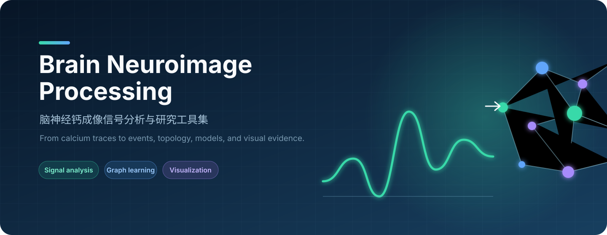
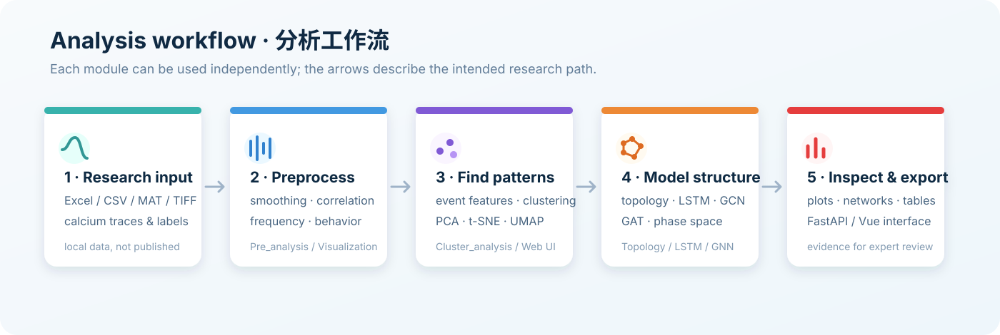
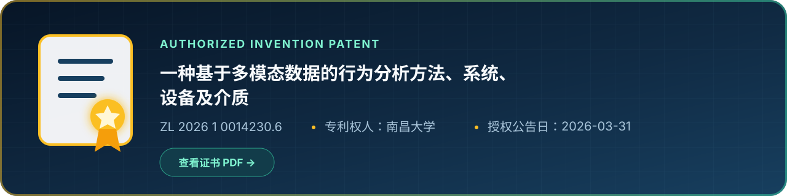

# Brain Neuroimage Processing

面向神经钙成像时间序列的研究型工具集：从信号预处理和钙瞬变提取，到聚类、网络拓扑、时序/图模型与交互式可视化。

> **项目状态：研究原型 / active research prototype。** 仓库由多个可独立使用的实验模块组成，目前不是单一、稳定、经过端到端验证的软件包。建议先运行 Web 演示，再按研究问题选择模块。所有输出都需要结合原始数据质量、实验设计和领域知识复核。

[快速体验](#快速体验web-演示) · [专利成果](#专利成果) · [模块导航](#模块导航) · [数据约定](#数据与结果) · [上游工具](docs/UPSTREAM_TOOLS.md) · [贡献指南](CONTRIBUTING.md) · [安全说明](SECURITY.md)

## 项目能做什么

仓库围绕小鼠神经钙成像数据积累了若干互补工作流：

- 从 Excel 时间序列中检测钙瞬变，计算持续时间、峰值、面积等事件特征；
- 用 K-means、DBSCAN、GMM、层次聚类、谱聚类及 PCA/t-SNE/UMAP 探索活动模式；
- 根据神经元活动、相关性和空间位置构建功能连接与动态拓扑；
- 尝试 LSTM、GCN、GAT、相空间重构和效应量分析等研究方法；
- 通过 FastAPI + Vue 或 Streamlit 界面预览参数、批量处理并导出结果。



这里的箭头表示推荐的研究路径，不表示所有模块已经串成一个自动流水线。多数目录仍是面向单项实验的脚本集合。

## 专利成果

[](docs/patents/cn-zl2026100142306-invention-patent-certificate.pdf)

本仓库收录以下与研究方向相关的知识产权成果：

| 项目 | 信息 |
| --- | --- |
| 发明名称 | 一种基于多模态数据的行为分析方法、系统、设备及介质 |
| 专利号 | ZL 2026 1 0014230.6 |
| 授权公告号 | CN 121456446 B |
| 专利权人 | 南昌大学 |
| 发明人 | 徐子晨、赵劲、胡文昊、吴琳鑫、聂维、胡成斌、胡佳慧、孙曼玉、潘秉兴、马帅 |
| 专利申请日 | 2026-01-07 |
| 授权公告日 | 2026-03-31 |

[查看发明专利证书（PDF，约 1.1 MB）](docs/patents/cn-zl2026100142306-invention-patent-certificate.pdf)

> **专利说明：** 证书在此作为相关知识产权成果记录收录。该记录不表示仓库中的每个模块均实施或受上述专利权利要求覆盖，也不通过本仓库授予任何专利许可。专利权有效性、权利人变更及其他法律状态以国家知识产权局专利登记簿和公告信息为准。

## 快速体验：Web 演示

仓库中最完整的交互入口位于 [`ai-mouse/BN/calcium_analysis_platform`](ai-mouse/BN/calcium_analysis_platform)。它包含 FastAPI 后端和 Vue 3 前端，支持 Excel 上传、单神经元预览、批量事件提取、K-means 聚类以及 PCA/t-SNE 可视化。

### 1. 生成合成数据

以下脚本只生成确定性的模拟轨迹，不读取仓库中的研究数据：

```bash
cd ai-mouse/BN/calcium_analysis_platform
python create_test_data.py
```

输出文件为 `test_data.xlsx`，包含名为 `dF` 的工作表。

### 2. 启动后端

建议使用 Python 3.10 或更新版本，并在你自己的隔离环境中安装模块依赖：

```bash
cd backend
python -m venv .venv
source .venv/bin/activate          # Windows: .venv\Scripts\activate
python -m pip install -r requirements.txt
python -m uvicorn main:app --host 127.0.0.1 --port 8000
```

API 文档位于 `http://127.0.0.1:8000/docs`。服务默认按本地研究工具设计，不应直接暴露到公网。

### 3. 启动前端

在另一个终端中使用符合项目 Vite 版本要求的 Node.js：

```bash
cd ai-mouse/BN/calcium_analysis_platform/frontend
npm ci
npm run dev -- --host 127.0.0.1
```

打开 `http://127.0.0.1:5173`，在“事件提取”页面上传前面生成的 `test_data.xlsx`。运行时上传文件和结果会写入后端的 `uploads/`、`results/`、`temp/`，这些目录已被 Git 忽略。

### 4. 运行后端安全边界测试

测试不需要真实数据，也不会写入仓库：

```bash
cd ai-mouse/BN/calcium_analysis_platform/backend
python -m unittest discover -s tests
```

## 模块导航

| 研究阶段 | 模块 | 代码中可见的主要内容 |
| --- | --- | --- |
| 预处理与探索 | [`Pre_analysis`](Pre_analysis) | 数据整合、平滑、相关性、频域、行为分布、热图和轨迹脚本 |
| 事件与可视化 | [`Visualization`](Visualization) | 钙波/事件提取、基线处理、聚类与波形展示 |
| 无监督模式 | [`Cluster_analysis`](Cluster_analysis) | K-means、DBSCAN、GMM、层次/谱聚类及降维脚本 |
| 功能网络 | [`Topology_analysis`](Topology_analysis) | 拓扑矩阵、时空网络、动态排序和模式-行为分析 |
| 时序与图学习 | [`LSTM`](LSTM) | LSTM 自编码、GCN/GAT、嵌入和网络可视化实验 |
| 状态分类 | [`StateClassifier`](StateClassifier) | 互信息、相空间重构、图构建、GCN 训练与可视化 |
| 关键神经元 | [`principal_neuron`](principal_neuron) | Cohen's d 效应量、共享/特异神经元、社区和空间分布 |
| 状态转移 | [`Markov`](Markov) | 行为状态马尔可夫链与发射/转移概率图 |
| GNN 实验 | [`rawgcn`](rawgcn)、[`bettergcn`](bettergcn)、[`CVPR`](CVPR) | 图分类、特征构建、模型对照与批量实验脚本 |
| SCN 专项 | [`SCN-Research-Project-main`](SCN-Research-Project-main) | SCN 状态分类、时间预测、归因和轨迹对比 |
| 交互入口 | [`ai-mouse/BN`](ai-mouse/BN) | FastAPI + Vue 平台与 Streamlit 原型 |

模块成熟度、输入列名和运行方式并不统一。优先阅读模块内的 README 和配置文件；不要把根目录 [`requirements.txt`](requirements.txt) 当成所有模块都经过兼容性验证的锁定环境。Web 演示应使用它自己的后端/前端依赖文件。

## 数据与结果

### Web 演示输入约定

- 文件格式：`.xlsx` 或 `.xls`；
- 必需工作表：`dF`；
- 第一列：时间或帧索引；
- 后续列：每个神经元的一条数值轨迹；
- 单个上传文件上限：50 MiB。

[`create_test_data.py`](ai-mouse/BN/calcium_analysis_platform/create_test_data.py) 是公开、可重复的输入示例。真实研究数据、模型权重、运行日志和批量结果不属于源码发布内容。

### 为什么仓库不附带研究数据

原始/处理后表格、显微图像、动物或实验编号、训练权重和上千张结果图可能包含未公开研究信息，也会使 Git 历史异常膨胀。`.gitignore` 已覆盖这些路径和常见格式；如需复现实验，应通过有权限的数据仓库、正式发布附件或合成/脱敏样本分发，并补充数据来源、许可证和伦理说明。

## 仓库结构

```text
Brain_Neuroimage_Processing/
├── ai-mouse/BN/                 # Web 与 Streamlit 入口
├── Pre_analysis/                # 预处理和探索性分析
├── Visualization/              # 事件提取与绘图
├── Cluster_analysis/            # 聚类和降维
├── Topology_analysis/           # 功能连接与时空拓扑
├── LSTM/                        # 时序/图学习实验
├── StateClassifier/             # 相空间 + GCN 状态分类
├── principal_neuron/            # 效应量和关键神经元
├── Markov/                      # 状态转移分析
├── rawgcn/ · bettergcn/ · CVPR/ # GNN 实验
├── SCN-Research-Project-main/   # SCN 专项工作流
├── docs/
│   ├── readme-assets/           # README 本地视觉素材
│   ├── patents/                 # 专利证书与知识产权材料
│   ├── research-notes/          # 方法研究记录
│   └── UPSTREAM_TOOLS.md        # 上游工具边界与链接
├── CONTRIBUTING.md
├── SECURITY.md
└── requirements.txt             # 遗留的跨模块依赖清单
```

CaImAn、suite2p、DeepCAD、DeepCAD-RT 和 DeepInterpolation 不属于本仓库的自研代码，也不应以复制完整源码的方式“集成”。公开版只记录如何与这些[上游工具](docs/UPSTREAM_TOOLS.md)配合使用。

## 方法边界与负责任使用

- 本仓库不是医疗器械，也没有针对临床诊断、治疗或个体决策进行验证。
- 自动事件检测、聚类和图模型会随采样率、平滑窗口、阈值、随机种子与数据质量显著变化。
- 当前没有可支持统一准确率、F1、AUC 或硬件性能承诺的受控基准，因此 README 不报告此类数字。
- 部分历史脚本仍包含实验专用默认路径或列名；公开贡献应逐步改为函数/命令行参数，并配套合成测试。
- 使用结果发表研究时，应记录软件版本、完整参数、数据排除规则和人工质量控制过程。

## 上游工具、贡献与安全

- 配套工具及其官方仓库：[`docs/UPSTREAM_TOOLS.md`](docs/UPSTREAM_TOOLS.md)
- 如何提交代码且不泄露研究数据：[`CONTRIBUTING.md`](CONTRIBUTING.md)
- Web 原型的部署边界与漏洞报告：[`SECURITY.md`](SECURITY.md)
- suite2p 与 CaImAn 对钙波研究的能力边界：[`docs/research-notes/calcium-wave-extraction.md`](docs/research-notes/calcium-wave-extraction.md)

## 许可证

仓库当前**没有顶层 `LICENSE` 文件**。公开可见不等于获得开源许可；在权利人明确选择许可证前，请不要假定代码、数据或文档可以被复制、修改或再分发。上游项目分别适用它们自己的许可证。

## English summary

Brain Neuroimage Processing is a research-oriented collection of calcium-imaging analysis scripts and prototypes. It covers trace preprocessing, transient feature extraction, clustering, functional topology, sequence/graph models, and local Web visualization. The repository also records a [related authorized invention patent](docs/patents/cn-zl2026100142306-invention-patent-certificate.pdf) owned by Nanchang University. Start with the synthetic-data Web demo above; treat the remaining directories as independent experimental modules. No real research data, model checkpoints, benchmark claims, or top-level software license are provided, and every scientific output requires domain review.
